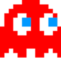

# asd-pacman
Building Pacman for the Advanced Software Development course using the ASD template

Try it out here: https://benspector3.github.io/projects/pacman/ (right click --> open in new tab)

# To clone this template:

Enter these commands into your bash terminal to clone the repository and delete the `.git/` folder:

```bash
git clone https://github.com/operationspark/asd-pacman.git
rm -rf asd-pacman/.git
```

# Learning Objectives:
- Continue to recognize patterns and reuse functions from prior projects, adjusting them to work in a new context
- Generate a maze from a 2D array
- Manage HTML elements in a 2D array
- Bonus/Challenge: implement an A.I. algorithm for the ghost to chase Pacman

# Helpful jQuery methods:
```js
// referencing existing/new HTML elements
var $element = $("#id");                // references an existing element
var $element = $("<elementType>");      // creates a new element. don't forget the "<>"!

// adding/removing HTML elements to/from other HTML elements
$element.appendTo($otherElement)        // inserts $element as a child of $otherElement
$element.detach()                       // removes the $element from its parent
$element.empty()                        // removes all children elements from $element

// styling HTML elements
$element.css("left", 100);              // draws the $element 100 pixels from the left of the screen (x = 100)
$element.css("top", 50);                // draws the $element 50 pixels from the top of the screen (y = 50)
$element.css("background-color", "red") // sets the background color of $element to "red"

// setting attributes to HTML elements
$element.addClass("myClass");           // sets the class attribute value for $element to "myClass"
$element.attr("id", "abc")              // sets the id attribute value for $element to "abc"
$element.attr("src", "img/file.png");   // sets the src attribute value for $element to "img/file.png"
```

# The Maze

The data that represents the maze for Pacman is stored in the file `js/levels.js`. This file has a function, `getLevel(level)`, that accepts a String (such as "level1") which is used to return the 2D Array that represents various levels. While there is currently only one level, it would be easy to add more. 

While the `getLevel` function may exist in a different file, `index.js` can still use it because they share the same _root folder_ `js`. Therefore, `getLevel(level)` may be called from anywhere inside `index.js` (or other files that may exist in the `js` folder. 

Notice, however, that in the `index.html` file, `js/level.js` file is loaded _before_ `js/index.js`. This allows the `getLevel` function to be loaded into memory before `index.js` attempts to use it.

**Your first task** is to create a helper function in `js/index.js` called `createMaze()` that renders the maze using the 2D array returned from `getLevel()`. 

Follow the pseudocode below to help create the `createMaze()` function:

```
store the 2D array returned from getLevel() in the global level variable 

FOR each row in the level:
  FOR each column in the each row of the level:
    genereate a new <div> HTML element with the class "square"
    position the new element in the correct row/column coordinate
    give the new element a unique id in the formate "r#c#"
    Depending on the value of the row/column in the level, manipulate the square further
```

- The 2D array will represent the level through a number system. `0` represents a square with a pellet inside, `1` represents a wall, and so on... 

- Every  number in the 2D array requires that you create a `<div class='square'>` HTML element which must be positioned in the correct coordinates based on its row and column. **Each `.square` element is appended directly to the `#board`**

- In addition, each `.square` element needs to have a unique `id` attribute assigned to it that follows the format: `r#c#` where the `#`s are replaced by the row and column position of that square in the 2D array. 

- Pellets, Pacman, and the Ghost require an additional `<div>` element to be created. Pellets will be _nested inside_ the square that they occupy. Pacman and the Ghosts do not belong to any specific square - instead they will also be appended directly to the `#board` and move _on top of_ the maze squares (setting the `z-index` CSS property to a high number ensures that pacman and the ghost will appear above any other HTML element).

Use the HTML templates below to help you create the various kinds of square elements that exist in the maze:

```html
<!-- 9: empty square -->
<div class='square' id="r10c5"></div>

<!-- 0: pellet -->
<div class='square' id="r10c5">
  <div class='pellet'></div>
</div>

<!-- 1: wall -->
<div class='square wall' id="r10c5"></div>

<!-- 7: ghost gate -->
<div class='square gate' id="r10c5"></div>

<!-- 2: pacman -->
</div>

<!-- 3: red ghost -->
</div>
```

# Pacman Pseudocode

```
Determine where Pacman should move to next

IF the next location is a wall:
  don't move pacman
ELSE:
  move and redraw pacman

IF pacman is in the same location as a pellet:
  "eat" the pellet by removing it from the screen
  increase the score 
  
IF pacman is in the same location as a ghost:
  end the game!
```
