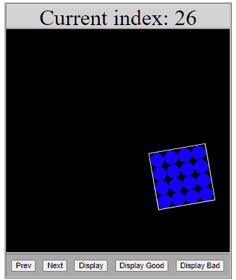

# Data Shapes

Practice moving data from objects, to variables, to parameters, and back again!

**Table of Contents**

- [Overview](#Overview)
  - [Learning Objectives](#learning-objectives)
  - [Project Grading](#project-grading)
- [Lesson Steps](#project-steps)
  - [TODO 0: Understand the Program](#todo-0-understand-the-program)
  - [TODO 1: Create More Data](#todo-1-create-more-data)
  - [TODO 2: Add a New Property](#todo-2-add-a-new-property)
  - [TODO 3: Help Display a Shape (Static)](#todo-3-help-display-a-shape-static)
  - [TODO 4: Help Display a Shape (Good Behavior)](#todo-4-help-display-a-shape-good-behavior)
  - [TODO 5: Help Display a Shape (Bad Behavior)](#todo-5-help-display-a-shape-bad-behavior)
  - [Submit Your Work](#submit-your-work)

# Overview



In this project, the goal is to create variables, functions, and objects; and pass the created data around in order to display various colored shapes in multiple different ways. Most of this program has already been completed, but it will be up to you to put in the finishing touches!

## Learning Objectives

- Understand the difference between data and containers for data (such as variables and parameters)
- Understand how passing data between containers is often necessary for programs to run
- Understand that objects are data, but because objects are complex data, they also store data within them
- Understand how to create and work with the data within objects

## Push Reminder

To push to GitHub, enter the following commands in bash:

```
git add -A
git commit -m "saving data shapes"
git push
```

## Project Grading

- TODO 0 - 5 points
- TODO 1 - 15 points
- TODO 2 - 30 points
- TODO 3 - 10 points
- TODO 4 - 20 points
- TODO 5 - 20 points

# Lesson Steps

Start by opening up the data-shapes folder, and then start the live server for its HTML file.

## TODO 0: Understand the Program

This program depends on a single array of objects to run. The objects all contain information about different shapes. Specifically, the type of shape (square, triangle, or circle), the color of the shape, and the number of times the shape repeats. These shapes will also have a "good" behavior associated with them, but you will have to add that in yourself. This behavior will determine what the shapes do when they are displayed.

Now, open up the program with live server.

On the preview page, you will see a box with information in it, the current index of the array being displayed, and five buttons. These buttons do the following:

- Prev: cycles through a data array by decreasing the current index being displayed and resets the display type to pure information
- Next: cycles through a data array by increasing the current index being displayed and resets the display type to pure information
- Display: shows a static image of the selected shape object
- Display Good: shows the selected shape object exhibiting "good" behavior
- Display Bad: shows the selected shape object doing everything except for "good" behavior, and the number of repetitions of the shape is increased as well

At this point, none of the "Display" buttons will work. You will have to add this functionality in yourself.

To show that you read this, add a comment on line 39 that says `"// TODO 0 complete"`

## TODO 1: Create More Data

By default, the program produces data for 26 different objects automatically. You will need to create a 27th object and add it to the end of the `dataShapes` array.

- **1a)** Create a variable called `shape` and give it an object with the following properties:

  - key: `color`, value: `"blue"`
  - key: `shape`, value: `"circle"`
  - key: `repeat`, value: `3`

- **1b)** Add this object to the end of the `dataShapes` array, which stores all objects.

> **HINT:** What method do arrays use to add elements to their end?

> **TESTING:**
>
> In the live server, click "Next" or "Prev" until you reach the last index number. If the highest index number is now 26 instead of 25, then you succeeded in adding a new object to the array.

## TODO 2: Add a New Property

For this TODO, you will need to add a new `goodBehavior` property to every object in the `dataShapes` array. The value of

- **2a)** Make a loop that iterates over the `dataShapes` array

- **2b)** In the body of the loop, create a new variable called `currentShape` and copy the current value of the `dataShapes` array into the new variable

> **HINT:** How do you use bracket notation to access the current element of an array while iterating?

- **2c)** If the `color` of the `currentShape` is `"red"`, set the `goodBehavior` property of the `currentShape` to be `"bounce"`

> **HINT:** How do you use dot notation to add a new property to an object?

- **2d)** Otherwise, if the `color` of the `currentShape` is `"blue"`, set the `goodBehavior` property of the `currentShape` to be `"blink"`

- **2e)** If the `color` of the `currentShape` is anything else, set the `goodBehavior` property of the `currentShape` to be `"spin"`

> **HINT:** 2c, 2d, and 2e are mutually exclusive; can they all be `if` statements? If not, what should they be?

## TODO 3: Help Display a Shape (Static)

This TODO will allow you to finally display shapes by clicking the "Display" button. To do so, you will have to both create a new function, and then call that function at the appropriate place.

- **3a)** Create a function called `handleStatic`. This function should have a single parameter called `data`. Inside of the function, you should do two things:

  1. Call the function `setBackgroundWithObject` (already created for you), and pass in `data` as its only argument
  2. Set `animationDetails.displayType` to store `1`

- **3b)** Find where TODO 3b is listed in your code. There, call your `handleStatic` function. It should take the current shape object as an argument. Check the below HINT for how to access the current shape, as it is *not* referring to the `currentShape` variable.

> **HINT:** `dataShapes` is your array of shape objects. The current index being displayed is stored in a variable called `currentIndex`. How can you use that to get the correct object from your `dataShapes` array and pass it into `handleStatic`?

> **TESTING:**
>
> In the live server, you should now see shapes appear if you click the "Display" button. Try testing with multiple shapes.

## TODO 4: Help Display a Shape (Good Behavior)

This TODO will allow you to display shapes through the "Display Good" button, which will animate the shapes according to their "good" behavior. Once again, you will need to create a new function and subsequently call that function.

- **4a)** Create a function called `handleGood`. This function should have three parameters called `color`, `shape`, and `repeat`. Inside of the function, you should do two things:

  1. Call the function `setBackgroundWithSimple` (already created for you), and pass in `color`, `shape`, and `repeat` as arguments
  2. Set `animationDetails.displayType` to store `2`

- **4b)** Find where TODO 4b is listed in your code. There, do the following:

  1. Create a new variable called `currentShape` and copy the shape from `dataShapes`'s `currentIndex` into that new variable.
  2. Call your `handleGood` function. It should take the values of `currentShape`'s `color`, `shape`, and `repeat` properties as arguments.

> **HINT:** Recall how to retrieve a value from an object if you know its keys (like `color`)

> **TESTING:**
>
> In the live server, you should now see shapes appear and animate if you click the "Display Good" button. Try testing with differently colored shapes.

## TODO 5: Help Display a Shape (Bad Behavior)

This TODO will allow you to display shapes through the "Display Bad" button, which will animate the shapes in every way except for their "good" behavior. Once again, you will need to create a new function and subsequently call that function.

- **5a)** Create a function called `handleBad`. This function should have two parameters called `data`, and `repeat`. Inside of the function, you should do three things:

  1. Increase `repeat` by `1`
  2. Call the function `setBackgroundWithMixed` (already created for you), and pass in `data` and `repeat` as arguments
  3. Set `animationDetails.displayType` to store `3`

- **5b)** Find where TODO 5b is listed in your code. There, do the following:

  1. Create a new variable called `currentShape` and copy the shape from `dataShapes`'s `currentIndex` into that new variable.
  2. Create a new variable called `repeat` and copy the value of `currentShape`'s `repeat` property into this new variable.
  2. Call your `handleBad` function. It should take the `currentShape` and `repeat` as arguments.

> **TESTING:**
>
> In the live server, you should now see shapes appear and animate if you click the "Display Bad" button. Try testing with differently colored shapes.

# Submit Your Work

Submit your work regularly. Because these files are already being tracked by your GitHub repo, you can skip the "git add" step. Instead, enter the following commands:

> git commit -a -m "saving data shapes"
>
> git push

Congratulations on completing this project!
