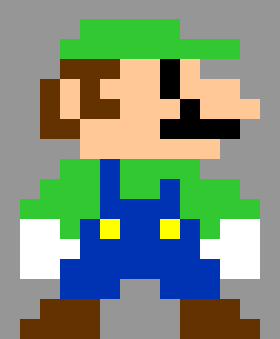
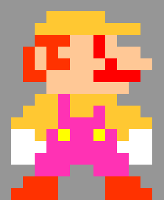

# Image Filtering

Use higher order functions to apply filters to images.

**Table of Contents**

- [Overview](#Overview)
  - [Learning Objectives](#learning-objectives)
  - [Project Grading](#project-grading)
- [TODOs](#todos)
  - [TODO 0: Study Existing Code (no coding)](#todo-0-study-existing-code-no-coding)
  - [TODO 1: Create the `applyFilter` Function Part 1](#todo-1-create-the-applyfilter-function-part-1)
  - [TODO 2: Create the `applyFilter` Function Part 2](#todo-2-create-the-applyfilter-function-part-2)
  - [TODO 3: Create a Filter Function](#todo-3-create-a-filter-function)
  - [TODO 4: Update `applyFilter`](#todo-4-update-applyfilter)
  - [TODO 5: Create the `keepInBounds` Function](#todo-5-create-the-keepinbounds-function)
  - [TODO 6: Create More Filter Functions](#todo-6-create-more-filter-functions)
  - [TODO 7: Create the `applyFilterNoBackground` Function](#todo-7-create-the-applyfilternobackground-function)
  - [Challenge Task: Smudge](#challenge-task-smudge)
  - [Submit Your Work](#submit-your-work)

# Overview

 ==> 

In this project you will be building a simple program that applies filters to images. You will also be creating multiple filters!

## Learning Objectives

- Practice working with multidimensional arrays
- Practice working with nested for loops
- Practice using higher order functions

## Push Reminder

To push to GitHub, enter the following commands in bash:

```
git add -A
git commit -m "saving image-filtering"
git push
```

## Project Grading

### Best Practices (15 points)

1. Use the built-in constants instead of magic numbers - 5 points
2. Use comments to describe your filters - 5 points
3. Use proper indentation - 5 points

### Program Progress (85 points)

- TODO 0 - 0 points, but important to go through anyway
- TODO 1 - 10 points
- TODO 2 - 20 points
- TODO 3 - 5 points
- TODO 4 - 10 points
- TODO 5 - 10 points
- TODO 6 - 10 points
- TODO 7 - 20 points
- Challenge - 25 points (bonus)
  **NOTE:** the bonus will not give you a score of over 100 should you earn that many points, but can be done as an alternative to the required TODOs.

# TODOs

## TODO 0: Study Existing Code (no coding)

Before you begin working, you should look at the `image.js` file to see what has already been provided for you. In that file, you will find the following:

- `SQUARE_SIZE` constant - change this if you want to change the size of the image. Note that you will also need to change the corresponding CSS for the `.square` class's `width` and `height` properties.
- `RED`, `GREEN`, and `BLUE` constants - use these for index values when you create your filters.
- `image` data - use this variable to refer to the array storing the image data. Note that it contains only "rgb strings".
- `render` function - you will not need to use this; your program already calls the function
- `rgbStringToArray` function - use this to convert the "rgb string" values into arrays of numbers that are easier to process.
- `rgbArrayToString` function - use this to convert a numerical array back into an "rgb string". You will need to convert your filtered data back into a string for it to apply.

> Once you have looked over the above and are comfortable with it, move on to the rest of the project below.

## TODO 1: Create the `applyFilter` Function Part 1

> **IMPORTANT:** This TODO and all future TODOs should be completed inside of the `index.js` file.

Your first task is to create an `applyFilter` function. This is a big one, so we'll break it down into steps across multiple TODOs.

- **1a)** Make a function called name `applyFilter`, and for now, don't give it any parameters. Also leave the code block empty until **1c**.

- **1b)** Call `applyFilter` in the `applyAndRender` function in the event handler section of your file. There is a comment that tells you where to put the function call.

- **1c)** Inside of the code block of `applyFilter`, make nested loops to iterate over your `image` data. Recall that `image` is a 2D array, and be careful not to mix up the counting variables of each loop. Reference either Greenlight or your slides (or do a Google search) if you need a reminder on how to iterate over a 2D array.

## TODO 2: Create the `applyFilter` Function Part 2

> **REMINDER:** Before moving on, go through TODO 0 if you haven't already to look at the code in `image.js`. The code in there can be used in your `index.js` file where you are currently working. This is important, because you will be using the `rgbStringToArray()` and `rgbArrayToString()` functions that were created in the `image.js` file.

Now, for this step, you will need to alter your image. **This should be done in the body of the inner loop**, and is done in five steps (one line of code each, in order).

- **2a)** Retrieve one of string values from the 2D `image` array using bracket notation; you should use the counting variables so that ultimately all values will be used. You will want to store this value in a variable called `rgbString`.

- **2b)** Make a new `rgbNumbers` variable. Call `rgbStringToArray()` with `rgbString` as an argument, and `rgbStringToArray()` will return a new array. Store the returned array in the `rgbNumbers` variable.

- **2c)** Alter the contents of the `rgbNumbers` array. For now, simply change the `RED` value to its maximum (`255`). Don't forget that you have the `RED`, `GREEN`, and `BLUE` constants to use as indices for your `rgbNumbers` array.

> **NOTE:** The `rgbNumbers` array (and any other array produced by `rgbStringToArray` consists of three values. Use the indices of `RED`, `GREEN`, and `BLUE` to access those three values. Each of them corresponds to the amount of red, green, or blue in the pixel that the array was created from.
>
> **Example:** `rgbNumbers[GREEN] = 0;` would set the "green" portion of the `rgbNumbers` array to `0` (thus removing all "green")

- **2d)** Call `rgbArrayToString()` with `rgbNumbers` as an argument. This will return a new string. Assign the new string back into the `rgbString` variable.

- **2e)** Assign `rgbString` back into the `image` array (put it at the same index location that you first pulled the original `rgbString` out of back in **2a.**).

> **TESTING:** Once this is done, check your preview to see if your image became much more yellow/orange/red. You will need to click "Apply Filter" to apply the filter. If the image changes colors, then you are ready for the next TODO!

## TODO 3: Create a Filter Function

This TODO requires you to make a filter function.

**CODE:** Create the following function:

- **Name:** `reddify`
- **Parameters:** 1 (name the parameter whatever you want, but expect it to be an array)
- **Returns:** Nothing
- **Description:** This function should do the following:
  1. Set the `RED` index of the array to have a value of `200`.
  2. Do **not** return anything.

That's it!

## TODO 4: Update `applyFilter`

Now, you need to make your `applyFilter` be a higher order function that uses other functions to apply filters to the image. This can be done in three steps.

- **4a)** Give your `applyFilter` function a single parameter called `filterFunction`. This parameter is going to store the filter function.
- **4b)** Up where you call your `applyFilter` function, plug `reddify` in as an argument. Remember that you are _not_ calling `reddify` here.
- **4c)** Find the line where `applyFilter` changes the `rgbNumbers` array. Replace that entire line with a call to `filterFunction` with `rgbNumbers` as the argument to `filterFunction`.

> **TESTING:** Your preview should now show your image tinted red, but not quite as red as before. If it doesn't, then check the following for errors:
>
> - make sure that you are **not** calling `reddify` when you pass it as an argument to `applyFilter`
> - make sure that you are **not** calling `filterFunction` in the parameter list
> - make sure that you **_are_** calling `filterFunction` with `rgbNumbers` as an argument on the correct line

## TODO 5: Create the `keepInBounds` Function

Now that `applyFilter` is a higher order function, you should make more filters to pass to `applyFilter`. Before you do that, however, you should also make a new helper function called `keepInBounds`.

> **READ:** When changing a color value, you must make sure that you never go above `255` or below `0`. While your browser won't do anything weird if you do go past those bounds, you may have unexpected results when applying multiple filters in a row. To avoid this, you must make a new function that will keep numbers within the range of `0` - `255`.

**CODE:** Create the following function:

- **Name:** `keepInBounds`
- **Parameters:** 1 (name the parameter whatever you want, but expect it to be a number)
- **Returns:** A number between `0` and `255`
- **Description:** This function should do the following:
  1. If the parameter has a value of less than `0`, return `0`.
  2. If the parameter has a value of greater than `255`, return `255`.
  3. If the parameter's value is between `0` and `255`, return the parameter's value.
  4. For full credit, you _MUST NOT_ use `if` statements in the function. Use `Math.max()` and `Math.min()` to decide what value to return. (Alternatively, you can look up the "ternary operator" on Google and use that, but it is not required).

> <details> <summary> CLICK FOR HINTS on using Math.max() and Math.min() </summary>
>
> `Math.max()` returns the largest value passed to it. For instance, `Math.max(20, 100)` would return `100`. By itself, this isn't very useful, but what if you used variables (or parameters, hint-hint).
>
> ```js
> // Example
> var x = 50;
> var y = 15;
> var result1 = Math.max(x, 30);
> var result2 = Math.max(y, 30);
> ```
>
> In this case, `result1` would be `50` and `result2` would be `30`.
>
> Notice what this means. By hard-coding `30` here and using a variable, `Math.max()` enforces a _minimum_ value. That is, you will never get a value of less than 30. **How can you use this to make sure that `keepInBounds` will never have a value of less than `0`?**
>
> `Math.min()` works similarly, but in reverse.
>
> ```js
> // Example
> var x = 50;
> var y = 15;
> var result1 = Math.min(x, 30);
> var result2 = Math.min(y, 30);
> ```
>
> In this case, `result1` would be `30` and `result2` would be `15`.
>
> See how this is the opposite of `Math.max()`? By hard-coding `30` here and using a variable, `Math.min()` enforces a _maximum_ value. That is, you will never get a value of _greater than_ 30. **How can you use this to make sure that `keepInBounds` will never have a value of greater than `255`?**
>
> **Final Hint:** You can pass the result of `Math.max()` as an argument to `Math.min()` if you wish. The reverse is also true. That would be the fastest way to write this code.
>
> Alternatively, you can make a temporary variable to store the results of the `Math.min()` and `Math.max()` function calls, then `return` that once you are done.
>
> </details>

<br>

> **TESTING:** Test your code by inserting the following lines into your program (you may delete them when the tests pass). Open up a preview of your work and check the console to see if `0`, `255`, and `127` are printing. If they are, then everything is good.

```js
console.log(keepInBounds(-30)); // should print 0
console.log(keepInBounds(300)); // should print 255
console.log(keepInBounds(127)); // should print 127
```

## TODO 6: Create More Filter Functions

Now it's time to finally create some more filter functions.

**CODE:** Create the following function:

- **Name:** `decreaseBlue`
- **Parameters:** 1 (name the parameter whatever you want, but expect it to be an array)
- **Returns:** Nothing
- **Description:** This function should do the following:
  1. Subtract `50` from the value stored at the array's `BLUE` index.
  2. Pass the resulting value from step 1's calculation as an argument to the `keepInBounds` function.
  3. Store the result of the `keepInBounds` call back into the array's `BLUE` index location.

> **HINT:** The code of your function should look like:
>
> ```
> <blue value> = keepInBounds(<blue value> - 50);
> ```

**CODE:** Create the following function:

- **Name:** `increaseGreenByBlue`
- **Parameters:** 1 (name the parameter whatever you want, but expect it to be an array)
- **Returns:** Nothing
- **Description:** This function should do the following:
  1. Add the value stored at the array's `GREEN` index and the value stored at the array's `BLUE` index together.
  2. Pass the resulting value from step 1's calculation as an argument to the `keepInBounds` function.
  3. Store the result of the `keepInBounds` call back into the array's `GREEN` index location.

> **HINT:** The code of your function should look like:
>
> ```
> <green value> = keepInBounds(<blue value> + <green value>);
> ```

> **TESTING:** Once you have both filters created, apply all three of them by calling `applyFilter` a total of three times, with each filter passed as arguments in turn. This should be done in the `applyAndRender` function where you are already calling `applyFilter` with `reddify`.

## TODO 7: Create the `applyFilterNoBackground` Function

- **7a)** Create a new function called `applyFilterNoBackground`. It should be identical to the `applyFilter` function except for one difference: it will not apply the filter to the background color! Yes, **you may copy/paste the `applyFilter` function and use that as a base for this new function.**

- **7b)** At the beginning of the `applyFilterNoBackground` function, store the background color of the image in a variable to be used later. The background color can be gotten by looking at the top left pixel of your image (recall what the index numbers for the top left pixel are).

> **WARNING:** Do not hard code the value of the background color.

- **7c)** Inside of the inner loop of `applyFilterNoBackground`, use a conditional statement to check if the current pixel value is equal to the background pixel value. If it is not, then apply the filter.

> **HINT:** There should be five lines of code in `applyFilterNoBackground` before completing **7c.**. Four of those lines of code are involved in applying the filter, so those lines need to be inside of the conditional's code block. One line, however, should not be inside of the code block, as it needs to happen no matter what (**Double hint: which line of code gets you a value that you need for your conditional's comparison?**).

> **TESTING:** Once you've got this function working, replace **TWO** of your three `applyFilter` function calls with `applyFilterNoBackground`. You should see only one filter alter the background color, but all of them will change the main image!

## Challenge Task: Smudge

As a final challenge, you can try to apply a smudge to your image. A smudge is where you take colors from neighboring pixels and slide them over, making it look like you smudged the image with your finger. You can even customize the smudge with filters to affect how much color (and even which colors!) you smudge over.

> If you want to give this challenge a try, here are some hints as to how to proceed:
>
> 1.  The best way to perform a smudge is to look at a neighbor pixel and copy **some** of its color over to the current pixel being altered. **DON'T** alter both at the same time. How you want to the neighbor to affect the current pixel should be determined by a new filter function.
> 2.  You will need a different H.O.F. than either `applyFilter` or `applyFilterNoBackground`. This is only because the filter functions for smudging will require multiple arguments.
> 3.  The way you iterate over your `image` array will determine which direction you can apply the smudge (e.g. left, right, up, down, or some combination thereof)
> 4.  Your filter function will need to take in at least two arguments (one for the pixel being altered and one for the neighbor pixel getting smudged over). If you are going to do a diagonal smudge (not recommended), then you **may** need more than two arguments for all pixels involved in the smudge, depending on the details of how you wish to do it.

# Submit Your Work

Submit your work regularly. Because these files are already being tracked by your GitHub repo, you can skip the "git add" step. Instead, enter the following commands:

> ```bash
> git commit -a -m "saving image filtering"
> git push
> ```

Congratulations on using using higher order functions in a practical application!
