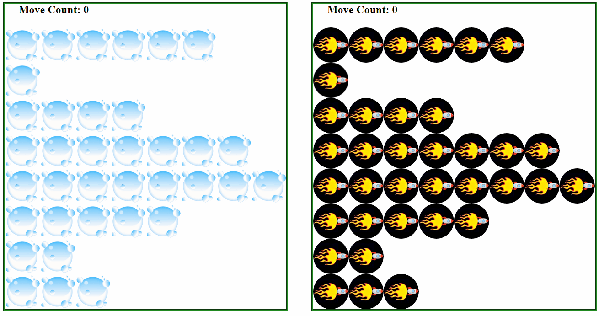

# ASD Sorting
Use recursion and implement sorting algorithms

**Table of Contents**
- [Overview](#Overview)
  - [Learning Objectives](#learning-objectives)
  - [Project Grading](#project-grading)
- [TODOs](#todos)
  - [TODO 0: Study Existing Code (no coding)](#todo-0-study-existing-code-no-coding)
  - [TODO 1: Create the `swap` Function](#todo-1-create-the-swap-function)
  - [TODO 2: Implement Bubble Sort](#todo-2-implement-bubble-sort)
  - [TODO 3: Create the `quickSort` Function](#todo-3-create-the-quicksort-function)
  - [TODO 4: `partition` Part 1](#todo-4-partition-part-1)
  - [TODO 5: `partition` Part 2](#todo-5-partition-part-2)
  - [TODO 6: Stress Test and Push](#todo-6-stress-test-and-push)
  - [Submit Your Work](#submit-your-work)

# Overview



In this project you will be building a program that sorts rows of images based on the number of images in the row. You will perform the sort using both bubble sort and quicksort. Note that each row corresponds to an object, and each object has a property called `value` that you will use to sort.

## Learning Objectives
- Practice bubble sort algorithm
- Practice recursion
- Practice quicksort algorithm

## Push Reminder
To push to GitHub, enter the following commands in bash:
```
git commit -a -m "saving sorting-exercise"
git push
```

## Project Grading

### Best Practices (25 points)

1. Use the built-in constants instead of magic numbers - 5 points
2. Use comments to describe what your functions are doing - 15 points
3. Use proper indentation - 5 points

### Program Progress (75 points)

* TODO 0 - 0 points, but important to go through anyway
* TODO 1 - 10 points
* TODO 2 - 15 points 
* TODO 3 - 20 points 
* TODO 4 - 15 points 
* TODO 5 - 15 points 
* TODO 6 - 0 points

# TODOs

## TODO 0: Study Existing Code (no coding)

Before you begin working, you should notice that thre are three JavaScript files already there. They are as follows:

<hr>

### **File 1: `setup.js`**

This file contains a lot, but there are only three things that you need to be aware of.
* Constants for setup - affect the number of rows and the ordering of them, as well as the speed at which elements are sorted. You may change these, and they are as follows:
    * `SLEEP_AMOUNT`: the lower this value, the faster the sort animation 
    * `MAX_SQUARES`: the number of rows that need to be sorted
    * `SEED`: affects the random order of rows
    * `FACTOR`: affects the random order of rows
    * `INCREASE`: affects the random order of rows
* Constants for managing the drawing on the screen. These constants are `IMAGE_SIZE`, `MAX_SQUARE_WIDTH`, and `MAX_SQUARE_HEIGHT`, and they should not be changed.
* Constants for jQuery references and arrays - all constants not listed above fall into this category. You should not change any of them. You will have to use some of them for your project, however. Those constants are also listed in your `index.js` file for your convenience, and they are as follows:
    * `bubbleCounter`: the CSS id of the counter used for displaying the number of swap operations that occurr during bubble sort
    * `quickCounter`: the CSS id of the counter used for displaying the number of swap operations that occurr during quicksort

<hr>

### **File 2: `run.js`**

This file registers the "Start" button with the event manager. You won't need to do anything with this file.

<hr>

### **File 3: `index.js`**

This is the only file you will be required to work with, and it is where you will implement your sort functions. Some helper functions have already been created for you. They are as follows:
* `sleep`: this (sort of) pauses execution so that your sorting can be redrawn one step at a time.
* `drawSwap`: this function redraws your screen to show the updated ordering every time a swap occurs. You must tell it which array to redraw from, and which to element indexes have been swapped.
* `updateCounter`: this function updates the specified counter after a swap occurs.

Once you have looked over the above and are comfortable with it, move on to the rest of the project below.

## TODO 1: Create the `swap` Function
Your first task is to create the `swap` function.

**CODE:** Create the following function:
* **Name:** `swap`
* **Parameters:**
    1. `array`: the array whose elements need to be rearranged
    2. `i`: the index of the first element to swap
    3. `j`: the index of the second element to swap
* **Returns:** Nothing
* **Description:** 
    1. `swap` switches two elements of the provided array. The elements are at indexes `i` and `j`. 
    2. ***After*** the two elements have been swapped, the helper function `drawSwap` (already provided) should be called with the arguments `(array, i, j)`. 

>**Hint:** You may want to create a temporary variable to complete the swap successfully.

## TODO 2: Implement Bubble Sort

The goal of this TODO is to implement bubbleSort. Below is a description of the function. 

>* **Name:** `bubbleSort`
>* **Parameters:**
>    1. `array`: the array whose elements need to be sorted
>* **Returns:** Nothing
>* **Description:** `bubbleSort` sorts all elements of the provided array from smallest to largest. It should also update the relevant swap counter and run at the specified rate so that the sorting can be properly visualized.

<hr>

* **2a)** Create the skeleton of the function described above. This means you should name it and give it the necessary parameter(s). That is all you need to do for this step.

>**IMPORTANT:** You must add the `async` keyword before the word `function`. This is required to make your sorting compatible with the `sleep` function, which is necessary to visualize your sorting. So, your function declaration should look like
>
>```js
>    async function nameOfFunction(params){}
>```

<hr>

* **2b)** Implement `bubbleSort`. In other words, make the function actually do the job it's supposed to do. Your comparison should check if the element with the lower index has a greater value than the element with the higher index. **Note that this version of bubble sort is different than the one you saw in class.** The pseudocode for it is as follows:

>```
>ITERATE over the array from i = 0 to i = length - 1
>  ITERATE over the array from j = length - 1 to j = i + 1
>    IF array[j]'s value < array[j - 1]'s value
>      swap array[j] and array[j - 1]
>```

For more of an explanation, click the arrow below.

><details> <summary> Bubble Sort Walkthrough </summary>
>
>The version of bubble sort used here requires two nested for loops. 
>
>The outer loop will iterate over the entire provided `array` (simple enough, right?). 
>
>The inner loop will iterate over all elements of the provided `array` that are **not guaranteed** to be sorted by that point. Because each iteration of the outer loop guarantees that at least one more element is correctly sorted at the end of the array, the inner loop can stop earlier each time the outer loop completes an iteration.
>
>The body of the inner loop will be a comparison. Because the outer loop's index will always be lower than the inner loop's (check for yourself that this is true!) **you only need to see if the element at the outer loop's index is greater than the element at the inner loop's index.** If so, then you should call `swap` with your `array` and two indexes (the two loop counting variables) as arguments.
>
></details>

<br>

>**IMPORTANT REMINDER:** The elements of the `array` are all objects with a special property called `value`. **You should compare the two elements' `value` properties when deciding which element is greater.** (example: `array[0].value` would get the value property from element `0` of the `array`)

<hr>

* **2c)** The final step for bubble sort is to make sure that it displays the sorting and counter as it runs. To do so, simply add the following lines of code to your `if` statement's code block (put them after you call `swap`).

```js
updateCounter(bubbleCounter);
await sleep();
```

>**NOTE:** `updateCounter` updates the counter with the id stored in `bubbleCounter`, while `await sleep()` works with the `sleep` function (one of the helper functions provided for you) to make sure that the sorting displays step by step.

>**TESTING:** You should test your code by opening it with live server and clicking the "Start" button. If the rows of bubbles end up sorted from smallest to largest, then you've completed `bubbleSort`!

## TODO 3: Create the `quickSort` Function

`quickSort` is interesting, because it (more-or-less) requires a helper function to work properly. You will deal with the helper function in TODOs 4 and 5. For this part, you will only need to make the actual `quickSort` function itself. You will not be able to test it until after TODO 4, however.

Here is a description of the function you must create.

>* **Name:** `quickSort`
>* **Parameters:**
>    1. `array`: the array whose elements need to be sorted
>    2. `left`: the leftmost index being considered for this pass through `quickSort`
>    3. `right`: the rightmost index being considered for this pass through `quickSort`
>* **Returns:** Nothing
>* **Description:** `quickSort` sorts all elements of the provided array from smallest to largest. It does this by repeating the following three steps:
>    1. call the `partition` function to partially sort the array and decide on a "partition" index. The partition index is used to divide the array for further sorting
>    2. Call `quickSort` on all unsorted elements of the array to the left of the partition index (if two or more exist)
>    3. Call `quickSort` on all unsorted elements of the array to the right of the partition index (if two or more exist); the element at the partiton index is included for the sorting

>**PSEUDOCODE (for your reference; detailed instructions are below):**
>```
>FUNCTION quicksort(array, left, right):
>   IF (right - left) > 0:
>     index = partition(array, left, right)
>     IF left < (index - 1):
>       quicksort(array, left, index - 1)
>     IF index < right:
>       quicksort(array, index, right)
>```

<hr>

* **3a)** For this step, create the skeleton of the function and set it up to take in the required parameters. 

>**IMPORTANT:** Just as with the `bubbleSort` function, you must add the `async` keyword before the word `function`. This is again required to make your sorting compatible with the `sleep` function, which is necessary to visualize your sorting. So, your function declaration should look like
>
>```js
>    async function nameOfFunction(params){}
>```

<hr>

* **3b)** Implement `quickSort`. Because recursion can get complicated quickly, we will break this down into four substeps.

    * **3b-1)** Check if `quickSort` should even run
        
        >**DETAILS:** Check if `right - left` is greater than `0`. If it is not, then you do not need to do anything else in the function. If it is, **then all of the code in substeps 3b-2 through 3b-4 should be run.**

    * **3b-2)** Call and use the `partition` function
        
        >**DETAILS:** Create a new variable called `index`. Assign the result of the `partition` function call to `index`. Call the `partition` function with the arguments `(array, left, right)`.
        >
        >**IMPORTANT:** Because `partition` will call `sleep` once implemented, you will need to also use the `await` keyword when calling `partition`. This must go immediately before the function call and after the assignment operator. Here is what the line should look like.
        >
        >```js
        >    var index = await functionName(arguments);
        >```

    * **3b-3)** Call `quicksort` for the left of the pivot index

        >**DETAILS:** After you call `partition`, you must do the following.
        >
        >1. Check if the parameter `left` is less than `index - 1`
        >2. If it is, then call `quickSort` with the arguments `(array, left, index - 1)`. You must also put the `await` keyword before the `quickSort` call.


    * **3b-4)** Call `quicksort` for the right of the pivot index

        >**DETAILS:** After your code from Substep 3, you must do the following.
        >
        >1. Check if the parameter `right` is greater than `index`
        >2. If it is, then call `quickSort` with the arguments `(array, index, right)`. You must also put the `await` keyword before the `quickSort` call.

## TODO 4: `partition` Part 1

Now that you have the `quickSort` function complete, you only need to complete the `partition` function.

Here is a description of the function you must create.

>* **Name:** `partition`
>* **Parameters:**
>    1. `array`: the array whose elements need to be sorted
>    2. `left`: the leftmost index being considered for this pass through `partition`
>    3. `right`: the rightmost index being considered for this pass through `partition`
>* **Returns:** A number representing the new partition index for `quickSort` (recall that the partition index in `quickSort` is obtained by calling `partition`)
>* **Description:** `partition` has several jobs in this program:
>    1. Figure out the new partition index for `quickSort`
>    2. Decide on a `pivot` value (used to partially sort the array)
>    3. Move all elements greater than `pivot` to the right of `pivot`
>    4. Move all elements less than `pivot` to the left of `pivot`
>    5. Update the counter and run the sorting at the specified rate for visualization purposes

>**PSEUDOCODE (for your reference; detailed instructions are below):**
>```
>FUNCTION partition (array, left, right):
>   pivot = select a pivot
>   WHILE left < right:
>     WHILE array[left] < pivot { left++ }
>     WHILE array[right] > pivot { right-- }
>     IF left < right:
>       swap array[left] and array[right]
>	
>   RETURN left + 1
>```

If that seems like a lot, don't worry. We will approach this problem one step at a time, and several of those tasks will be taken care of in TODO 5. 

For this TODO, you will only need to:

1. Create the function skeleton
2. Decide on a pivot
3. Set up an important loop
4. Return the new partition index 

<hr>

* **4a)** Create the function skeleton. As usual, give the function its name, its parameters, and remember to put `async` before the function declaration. Feel free to reference one of the earlier TODOs if you need a reminder of what that looks like.

<hr>

* **4b)** Decide on a pivot. 
    >**READ:**
    >A "pivot" is a value that you use to decide where other values should go. If the pivot is the number `5`, for instance, then all numbers less than `5` should be put on the left of the pivot in the array, and all numbers greater than `5` should be put to the right of it.
    >
    >Truthfully, a random pivot is ideal (note: the pivot must exist within the array, however). That said, because we want it to be easier to test, we will not use a random pivot this time.
    
    >**CODE:** Use the following code to decide on the pivot:
    >
    >```js
    >array[Math.floor((right + left)/2)].value;
    >```
    >
    >This picks the middle element's value between `left` and `right` as the pivot value. Take the line of code above and assign it to a new variable called `pivot`.

<hr>

* **4c)** Set up the outer loop.

    >**READ:** To decide on the partition index for `quickSort`, you will need to change `left` and `right` until `left` is greater than `right`. Because of how you change the two variables, you don't know how many changes will be necessary before that happens. This means you will need a `while` loop. 
    
    >**CODE:** The `while` loop should run for as long as `left` is less than `right`. Put the `while` loop into your function directly below your `pivot` variable declaration. The loop should not do anything yet, so give it an empty code block.

<hr>

* **4d)** Return the new partition index. Do so by putting `return left + 1;` as the final line of `partition`. 

If you recall, the `index` value returned from `partition` back in `quicksort` is used to subdivide the array further for future calls to `quicksort`. Why `left + 1` is the partition you need has to do with how `quickSort` works. 

Essentially, `left` (by the time `partition` completes) is at the point in the array where everything larger than the previous pivot is now to the pivot's right, while everything smaller than the previous pivot is now to the pivot's left. You need the `+ 1` to avoid resorting a part of the array that is already sorted.

## TODO 5: `partition` Part 2

Here, you will complete the `partition` function. You will do so by finally filling in the code block for the `while` loop. There are three parts to the `while` loop's code, and we will go through them in turn.

Keep in mind that what is happening here is two things at once.

1. The partition index is being decided
2. The program is searching for values that need to be swapped.

**All of this is happening inside of the outer `while` loop.** The `while` loop finishes when `left` is not less than `right`, which means you've looked at every element in this section of the array. Now, let's make those two things happen!

<hr>

* **5a)** First inner `while` loop

    >**READ:** The first `while` loop should change the `left` value until it finds an element whose value is greater than or equal to the `pivot` value.

    >**CODE:** Create a `while` loop that does the following:
    >
    >1. Runs while the current `left` element's `value` property is less than the `pivot` value.
    >2. The body of the loop should increase `left` by `1` each pass.

    <br>

    >**Hint:** Don't forget that `left` is an index number and therefore must be used with an array to be useful. Also don't forget that `array` is an array of objects, and `value` is a property of the individual objects. For example, if you wanted to check if the first element's `value` is `10`, you could do so with the following code:
    >
    >`if (array[0].value === 10) {}`
    >
    >Please keep in mind that the above code is an **example** of how to get compare the first element's value to the number 10, and should not actually be placed in the program.

<hr>

* **5b)** Second inner `while` loop

    >**READ:** The second `while` loop should change the `right` value until it finds an element whose value is less than or equal to the `pivot` value. This `while` loop should go directly after the first inner `while` loop.

    >**CODE:** Create a `while` loop that does the following:
    >
    >1. Runs while the current `right` element's `value` property is greater than the `pivot` value.
    >2. The body of the loop should decrease `right` by `1` each pass.

<hr>

* **5c)** Swap when ready

    >**READ:** After both of the inner `while` loops have run, the value at index `left` must be greater than the `pivot`, and the value at index `right` must be less than the `pivot`. This can happen for one of two reasons. 
    >
    >1. `left` is now greater (or equal to) `right`, in which case we don't want to do anything.
    >2. The `left` and `right` elements need to be swapped!

    <br>

    >**CODE:** You need to check for the second case mentioned above. Make a conditional that checks if `left` is still less than `right`. If it is, then you must do the following three things (in order).
    >
    >1. Call `swap` with arguments `(array, left, right)`
    >2. Call `updateCounter` with the argument `quickCounter`
    >3. Call `await sleep();`

Once that is done, you should be done! Save your work and test your code by opening up the page in live server.

## TODO 6: Stress Test and Push

If everything is working so far, then head into `setup.js` and change a few things around. 

Increase `MAX_SQUARES` to something big (but not too big; the CSS starts to fail with larger numbers). Try a number between `100` and `1000`.

Decrease `SLEEP_AMOUNT` to something small, so you can watch the sorting happen faster. The bigger `MAX_SQUARES`, the smaller `SLEEP_AMOUNT` should be (`0` at the minimum).

Test your program again to really see the difference between bubble sort and quick sort.

# Submit Your Work

Submit your work regularly. Because these files are already being tracked by your GitHub repo, you can skip the "git add" step. Instead, enter the following commands:

```bash
git commit -a -m "saving sorting exercise"
git push
```

Congratulations on implementing sort algorithms!
