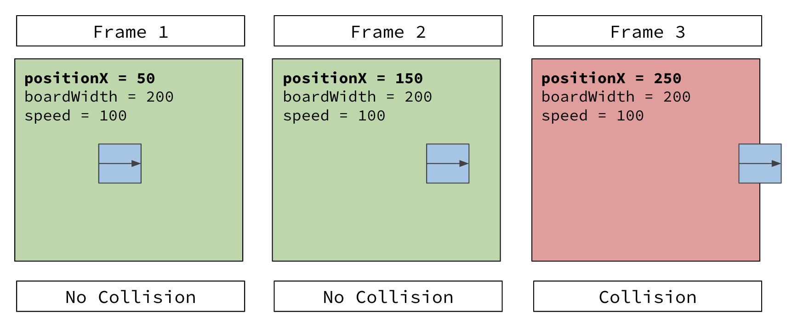
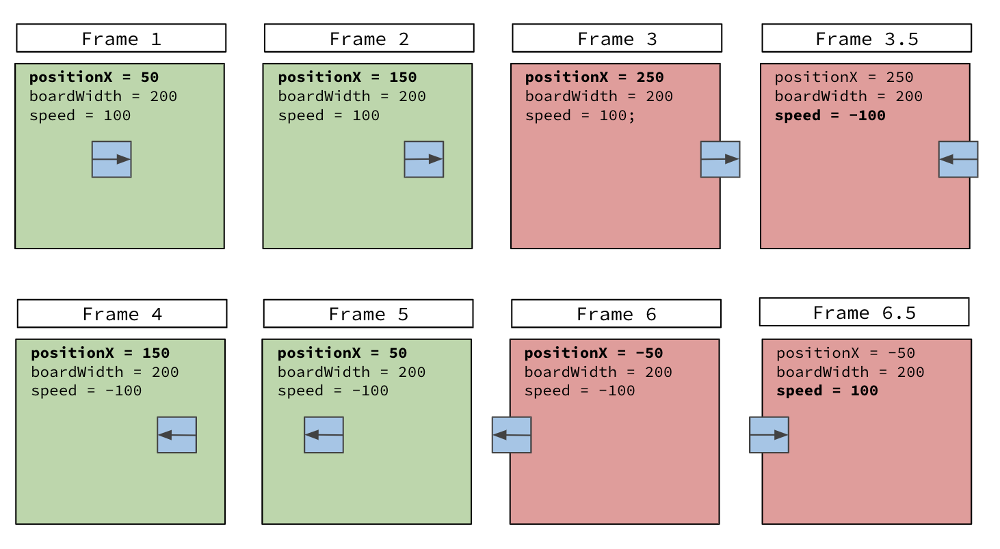
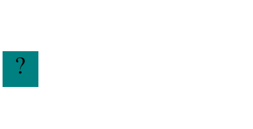

<a rel="license" href="http://creativecommons.org/licenses/by-nc-sa/4.0/"></a><br />This work is licensed under a <a rel="license" href="http://creativecommons.org/licenses/by-nc-sa/4.0/">Creative Commons Attribution-NonCommercial-ShareAlike 4.0 International License</a>.

# Bouncing Box

**Table of Contents**
- [Overview](#overview) 
- [A note about jQuery in this project](#a-note-about-jQuery-in-this-project)
- [Lesson Steps](#lesson-steps)
    - [TODO 0.5: Run the program](#todo-0.5-run-the-program)
    - [TODO 1: Learn how to move the box](#todo-1-learn-how-to-move-the-box)
    - [TODO 2: Use Variables to remember where we've been](#todo-2-use-variables-to-remember-where-weve-been)
    - [TODO 3: Respond to Click Events](#todo-3-respond-to-click-events)
    - [TODO 4: Keeping Score](#todo-4-keeping-score)
    - [TODO 5: Speeding Up](#todo-5-speeding-up)
    - [TODO 6: Make the Box Bounce](#todo-6-make-the-box-bounce)
    - [TODO 7: Fix a bug!](#todo-7-fix-a-bug)
    - [TODO 8: Go Live](#todo-8-go-live)

# Overview
We're going to create a simple game where a box moves across the screen at an increased speed after each click.

<a href="https://output.jsbin.com/goyuhod/9" target="_blank"> When you are done it should look like this (Right Click --> Open in new tab) </a>


Our goal for this game is to learn how to bring together HTML, CSS, and JavaScript. We used: 
   * HTML to define our structure 
   * CSS to define the style of that structure 
   * JavaScript in order to implement behavior

One of the primary ways we can implement behavior in JavaScript is by making modifications to the HTML and CSS in response to **events** which we will demonstrate by making this simple game. 

### **Take Aways**
This project will introduce you to a few key concepts: 
* Introduction to principals of animation
* Introduction to event handling with jQuery
* Introduction to cartesian coordinates
* Using JavaScript to manipulate HTML elements
* Using Variables to store data through the lifetime of a program
* Using `if` statements to conditionally make changes to the game

### **Work Flow**

For this program you will be given _**stencil code**_ found in the `index.html` file. This stencil will set up the program for you so that you can focus on the take aways of this project.

   * <details>
     <summary> How to navigate TODOS </summary>

      To complete the assignment, below you'll find numbered **TODO** lesson steps.  Each TODO will take you one step closer to completing the project and often times you may be required to complete multiple TODOs to complete a feature of the program. 

      Please follow the instructions closely. Sometimes we may only show you code examples to make a point, and there is no code required to be entered. These instructions will often be labeled with **FIND**. In the steps that do require inputing some code, you will be explicitly told to do so. These steps will be labeled with **CODE:**. When entering code make sure to read the instructions closely to see _where_ you are supposed to write your code. Occasionally you will receive hints for the coding steps. These hints will be labeled with **HINTS:**. Finally **Save and Observe** sections give you explanations of what your code is doing. You should not actually do anything in these sections; just try to understand what is going on.
      </details>

### **A note about jQuery in this project**
<details>
<summary> Read if curious about how it all works </summary>
We are going to be using [jQuery](https://jquery.com) for this exercise. You can see that we've included it in our web page with the following HTML 

    <script src="//cdnjs.cloudflare.com/ajax/libs/jquery/2.1.1/jquery.min.js"></script>

jQuery is a powerful library which makes building web pages easier. It is also tremendously popular. If you are doing web development in 2015, you will likely run into jQuery. That is why we are introducing just a tiny bit of it here. 

You can recognize jQuery by its use of a very curious function `jQuery()` Here is some of the jQuery code we use in this page:

```javascript
var box = jQuery('.box');
var board = jQuery('.board');
var boardWidth = board.width();	// the maximum X-Coordinate of the screen
```

The `jQuery` Function allows us to bring HTML elements into our JavaScript code. Consider this line of code:

```javascript
var board = jQuery('.board');	// reference to the HTML .board element
```

The `body` element, which has the `class="board"` attribute, can be selected using the `jQuery` Function by providing the `.board` CSS selector as an Argument.

The `board.width()` Function calculates the width of that `body` element. 

Since the width of the screen, the screen resolution, or the size of the window running the game could all be different, this is the only way for us to know where the edge of the screen is.

</details>
<hr>

# Lesson Steps

## **TODO 0.5:** *Run the program*

**FIND:**
* Locate the `index.html` file inside of your bouncing box project folder
* Select "Preview with Live Server".
<hr>

## **TODO 1:** *Learn how to move the box*

**IMPORTANT:**This TODO has 2 steps. Make sure to complete all steps before moving on!

Moving the box requires us to change the CSS of the box. However, CSS can only be hardcoded - once it is set, it won't change unless the programmer changes it.

Using the `jQuery()` Function we can instead change the CSS with JavaScript code. This will open the door to animation.

### **Part 1: Move the `box` with CSS**

In this first step, we'll see how we can manually move the box using CSS.

**FIND:** 
   * Locate the `<style>` tag within the `index.html` file. This is where the CSS that styles the box is defined. 

**CODE:** 

   * Change the `left` CSS property to the following values one at a time. For each value, observe where the box ends up at each value:
        - `200px`
        - `300px`
        - `400px`
        - `0px` 

            *  The `left` property determines how far from the _left_ side of the screen the box is. 
                - As the value increases, the box moves to the right. 
                - As the value decreases, the box moves to the left. 
                - `0px` sets the box to the left side of the screen.

   * Give the `left` property a final value for the starting position for the `box`.

### **Part 2: Move the `box` with JavaScript**

CSS allows us to hard code a starting position for the box. If we want the position of the box to change continuously, we'll need to use JavaScript.

**FIND:** 

* Locate the `<script>` tag within the `index.html` file. 
* Then, find the `moveBoxTo` Function (around **line 47**). 
      <details> 
      <summary>It looks like this:</summary>

    ```js
       function moveBoxTo(newPositionX) {
         box.css("left", newPositionX);
      }
    ``` 
    </details>

    * This Function uses `jQuery` and the `box.css()` Function to change the `left` CSS property of the box. When you call the Function, simply provide a value for `newPositionX`.

* Next, find the `update` function's `{code block}` (around line 69).

**CODE:** 

* In the `update` Function call the `moveBoxTo()` Function with an Argument of `100`. 
    <details>
    <summary>The update function should look like this:</summary>

    ```javascript
    function update() {
        /* Your Function Call Here */
    
    };
    ```
    </details>

    * **HINT:** To call a Function, use the following syntax: `nameOfFunction(arguments)`

* Now, replace `100` with increasingly larger values. 
    * At what value does the box go off the right edge of the screen? 

* Now try `moveBoxTo(boardWidth);`

Right now we are still hard-coding this position. We want this value to change over time so that the box moves on its own.

#### **Important:** There should only be one call to `moveBoxTo` inside your `update()` function **at any time during this project**. Always think about if a step is asking you to put in a new line of code before you do. **Extra code can be just as bad as missing code.**
<hr>

## **TODO 2:** *Use Variables to remember where we've been*

**IMPORTANT:** This TODO has 3 steps. Make sure to complete all steps before moving on.

We can manually move the box by calling the Function `moveBoxTo(10)` and then `moveBoxTo(20)` and then `moveBoxTo(30)` and so on but this is not animation.

**Animation** requires us to re-draw the box in a new location on every Frame. If we want the box to move `10` pixels on each Frame:
- On **Frame 1** the box should be at position `0`
- On **Frame 2** the box should be at position `10`
- On **Frame 3** the box should be at position `20`
- So on...

The `update` Function is called 20 times/second so we can use it to draw a new Frame each time it is called. This gives us 20 Frames/second! On each frame, we need the `update` Function to `moveBoxTo()` a _different_ and _changing_ location on each Frame. **This means that the computer will need to remember where the box was on Frame 1 in order to re-draw the box on Frame 2.**

Variables allow the computer to remember pieces of information as our program runs. If we create a variable called `positionX`, on each Frame we can:
- increment the value on each Frame: `positionX = positionX + 10`
- and then call the Function `moveBoxTo(positionX)`.

## **TODO 2 Part 1:** *Declare your Variable*

**FIND:** 
   * The comment in your file that says `// TODO 2 - Variable Declarations`
     ><details>
     ><summary> Something like this </summary>
     >
     >  ```javascript
     >     // TODO 2 - Variable declarations 
     >
     >     /* Your Variable Declaration HERE */
     >   ```
     ></details>

**CODE:** 
   * Declare a new Variable called `positionX` and assign the value `0` to it.


     * <details>
       <summary> HINT: To declare a Variable, use this syntax:</summary>

         ```js
            var myVariable = someValue;
         ```
       </details>

## **TODO 2 Part 2:** *Replace the hard-coded value*

**FIND:** 

* Locate the `update()` Function

**CODE:** 

* Replace the hard-coded value in `moveBoxTo()` with your new Variable. 

   * <details> 
     <summary> Click to verify your code looks like this:</summary>

     ```javascript
     function update() {
      moveBoxTo(positionX);

     };
     ```
</details>
<hr>

## **TODO 2 Part 3:** *Increase `positionX` on each Frame*

The `update` Function is being called 20 times/second. Each time it is called, `moveBoxTo(positionX)` is being called.

Because `positionX` is not changing, the box is being re-drawn in the same position. To get the box to move, we need to change the value of `positionX` on each "Frame". 

**FIND:** 

* Locate the `update` Function


**CODE:** 
* At the top of the `update` Function code block, add a comment that says we want to increase the value of `positionX` by `10`

    ```javascript
     function update() {
        /* Your Code to Increase positionX by 10 HERE*/
        moveBoxTo(positionX);
    
     };
    ```

* Below the comment you just added, increase the value of `positionX` by `10` on each Frame:


   >*  <details> 
   >    <summary> HINT: To increase a Variable by `10` we can write:</summary>
   >
   >    ```javascript
   >    myVariable = myVariable + 10;
   >    ```
></details>


### **Save and Observe**
Let's take a second to understand how this will work. Remember, `update()` is called 20 times/second. Each time the `update` Function is called a new "Frame" is drawn. So, over time, our code will look like this:

```javascript
// When you first create the Variable...
var positionX = 0;

// during update... 
// Frame 1
positionX = 0 + 10;         // positionX = 10
moveBoxTo(positionX);

// Frame 2
positionX = 10 + 10;         // positionX = 20
moveBoxTo(positionX);

// Frame 3
positionX = 20 + 10;         // positionX = 30
moveBoxTo(positionX);

// Frame 4
positionX = 30 + 10;         // positionX = 40
moveBoxTo(positionX);

// so on...
```
<hr>

## **TODO 3:** *Respond to Click Events* 

While the `update` Function is called non-stop 20 times/second, the `handleBoxClick` Function is programmed to be called each time the box is clicked. 

One of our goals is to reset the box to the starting position when the box is clicked.

**FIND:** 

* Locate the `handleBoxClick` Function.

 

**Code:** 

* Modify the `handleBoxClick` Function to re-assign the value of `positionX` to `0`.   
   ><details>
   ><summary>
   >   Your Function should look like this:
   ></summary>
   >
   > ```javascript
   > function handleBoxClick() {
   >   positionX = 0;
   > 
   > }
   > ```
   ></details>

### **Save, Observe**

Now, you can click on the box and it will return back to the starting position. Let's take a second to understand how this will work. The `update` Function will be constantly moving our box to a new position. However, if in between frames you click on the box, the position will be reset. 

Below, we can see what will happen if the box is clicked between Frames 2 and 3.

```javascript
// When you first create the Variable...
var positionX = 0;

// during update... 
// Frame 1
positionX = 0 + 10;         // positionX = 10
moveBoxTo(positionX);

// Frame 2
positionX = 10 + 10;        // positionX = 20
moveBoxTo(positionX);

// The Box is Clicked
positionX = 0;              // positionX = 0

// back to update...
// Frame 3
positionX = 0 + 10;         // positionX = 10
moveBoxTo(positionX);

// Frame 4
positionX = 10 + 10;         // positionX = 20
moveBoxTo(positionX);

// so on...
```
<hr>

## **TODO 4:** *Keeping Score*

**IMPORTANT:** This TODO has 4 steps. Make sure to complete all steps before moving on.

Each time the box is clicked, we also want to keep score and display that score on the box. 

To change the text displayed on the box, you can use the `changeBoxText()` Function, which has been created for you. It uses the `jQuery` Function `box.text()` to modify the text displayed on the box.

In order for the box to show the correct number of points, we'll need to:
- Use the `changeBoxText()` Function.
- Create a Variable to remember how many times the box has been clicked. 
- Call the Function using the Variable
- Increase the value of the Variable each time the box is clicked.

## **TODO 4 Part 1:** *Call the `changeBoxText()` Function*

**FIND:** 

* Locate the `handleBoxClick` Function.

**CODE:** 

* Add a call to the `changeBoxText()` Function. 
 
   ><details>
   ><summary> Make sure your `handleBoxClick` Function looks like this: </summary>
   >
   >```javascript
   >function handleBoxClick() {
   >    positionX = 0;
   >    changeBoxText(1);
   >    
   >
   >```
   </details>

**TEST:** 
* Now try clicking on the box. In addition to resetting the position of the box, it should also change the text on the box to display `1`. 

Again, however, this value is hard-coded. No matter how many times we click on the box, it will only ever change the text to `1`. So we need another Variable!


## **TODO 4 Part 2:** *Create a Variable*

**FIND**: 
* Locate your variable declaration for `positionX` below `// TODO 2`. 

**CODE:** 

* Declare a new variable called `points` and assign it to the value `0`. 

## **TODO 4 Part 3:** *Replace the hard-coded value*

**FIND:** 

* Locate the `handleBoxClick` Function. 
   ><details>
   ><summary> It will look like this:</summary>
   >
   >```javascript
   >function handleBoxClick() {
   >    positionX = 0;
   >    changeBoxText(1);
   >    
   >
   >```
   ></details>

**CODE** 

* Modify the `changeBoxText()` Function Call so that it uses your new `points` Variable as an argument instead of the hard-coded value `1`.

## **TODO 4 Part 4:** *Increase the value of `points` when the box is clicked*

Our `points` Variable is still hard-coded to the value `0`. If we want it to increase each time the box is clicked, we need to tell the computer!

**FIND:** 
* Locate the `handleBoxClick` Function. 

**CODE:** 
* Add a new line of code to this Function that increases the value of `points` by `1` each time the box is clicked. Make sure you add it _before_ you call `changeBoxText(points)`!

   ```javascript
   function handleBoxClick() {
       positionX = 0;

       // your code to increase the points variable by 1

       changeBoxText(points);
   }
   ```

**Hint**: To increase `positionX` by `10` we wrote: `positionX = positionX + 10;`. How can you increase `points` by `1`?
<hr>

## **TODO 5:** *Speeding Up*

**IMPORTANT:** This TODO has 3 steps that you will need to complete on your own. 

Now that we can keep track of how many times we've clicked on the box, we also want to make the game harder after each click! 

**FIND:** 

* Locate the `update` Function. 
   ><details>
   ><summary> It should look like this: </summary>
   >
   >```javascript
   >function update() {
   >    positionX = positionX + 10;
   >    moveBoxTo(positionX);
   >};
   >```
   ></details>

>Currently, our program is hard-coded to increase `positionX` by `10` on every Frame. This means that the *speed* of our box is fixed to `10` pixels/frame. 
>
>In order to allow this speed to change over the course of our program, we will need to remember how fast our box is moving. This means we'll create a new **Variable**.
>
>So far, we've introduced 2 Variables to our program: `positionX` and `points`. Each variable changes over time and/or when the box is clicked. Use your knowledge of Variables to introduce a new Variable `speed` into the program with the next step!

## **TODO 5 Part 1:** *Declare your Variable*

**CODE:** 
* Declare a new Variable called `speed` and assign it the value `10`.

    * **HINT** This variable should be declared with your other Variables `positionX` and `points`.

## **TODO 5 Part 2:** *Replace the hard-coded value*

**FIND:** 
* Locate the `update` Function.

**CODE** 
* Modify this code so that it uses your new `speed` Variable to change `positionX` instead of the hard-coded value `10`.


## **TODO 5 Part 3:** *Increase the value of `speed` when the box is clicked*

**FIND:** 

* Locate the `handleBoxClick` Function.

**CODE:** 

* Add a new line of code to this Function that increases the value of `speed` by `3` each time the box is clicked. 


### **Check in with your code**

Before moving on to the last TODO, test your program and make sure that your code works properly.

Your program should satisfy the following requirements:
- The program should have no syntax errors. You can find syntax errors by looking at the console. 
- The box should move across the screen from left to right
- The box should display the correct number of times that you have clicked on it
- The box should speed up when it is clicked

# TODO 6: Make the Box Bounce

**IMPORTANT:** This TODO has 2 steps. Make sure to complete all steps before moving on.

Detecting when one Object collides with another is one of the most common problems to solve when writing a video game. It is often more difficult than deciding what to do once that collision has been detected.

In our game, we need to detect when the box collides with the right wall and the left wall. The illustration below shows how this may play out from Frame to Frame:



The collision occurs on Frame 3 when `positionX` (`250`) is *greater than* the constant Variable `boardWidth` (`200`): 

- The `boardWidth` variable is the **Maximum x-coordinate of the screen**. Anything greater than that value will be off the screen to the right.

Even though the collision doesn't occur until Frame 3, the program has to check for collisions on each Frame and be ready to respond **IF** that collision occurs.

## TODO 6 Part1: Detecting Collisions on the right wall

**FIND:** 

* Locate the `update` Function since we need to check for collisions on every Frame. 

**CODE:** 

* Add a Conditional Statement to the Function. It should translate to:

    **IF positionX is greater than boardWidth:
        Change Direction of the Box**

    * **HINT:** To create a Conditional statement, use this syntax:

        ```javascript
        if (conditionIsTrue) {
             // then do X, Y, and Z
        }
        ```

        * If you are having trouble figuring out how to change direction of the box, See the Hint below:

          ><details> 
          ><summary> HINT: Changing Direction </summary>
          >
          >If you need help understanding how we can change the direction of the box, take a look at the illustration below:
          >
          >
          >
          >In **Frame 3.5**, _after_ the collision has been detected but before the next Frame, notice that the `speed` Variable changes from positive `100` to negative `-100`. This change allows the box to change direction.
          >
          >- On each `update` Frame, `positionX` is re-calculated as `positionX + speed`. So, if a positive `speed` moves the box to the right, a negative `speed` would move the box to the left.
          >
          >In Frame 4, 5, and 6 we can see the box moving to the _left_ with this new negative `speed` until it collides with the left wall.
          >
          ></details>

**CODE:** 

* In the `{ code block }` of your conditional statement, modify your code to change `speed` to be negative. You can do this in any one of the following ways:
    - `speed = -speed;`
    - `speed *= -1;`
    - `speed = speed * -1;`


## **TODO 6 Part 2:** *Bounce the box off the left wall.*

Now, using what you've learned about how to bounce the box off the right wall, it's time to bounce the box off the left wall.

**CODE:** 

* Below the `if` statement you just wrote, add another that translates to:

    **IF positionX is less than the MINIMUM X-Coordinate of the screen:
        change speed to be positive**

    * **HINT:** `0` is the **MINIMUM** x-coordinate of the screen. Anything less than `0` will be off the screen to the left.

      * If you can't get it to work properly, take a look at the below hints.


        ><details> <summary> Hints for common issues </summary>
        >
        >## Issue 1: the box wiggles (right or left side).
        >
        >If you see your box doing this...
        ><br>
        >
        >
        >Then that means that one or both of your boundary comparisons are incorrect. There are two possible places where this could go wrong.
        >
        >### Potential Problem 1: incorrect values in the comparison
        >
        >For both the left and right bounces, you must check the positionX against a single boundary. 
        >
        >For the right side, check the beginning of TODO 6 (before TODO 6.1) to see what variable stores the right boundary's x position.
        >
        >For the left side, check the first **HINT** in TODO 6.2 to see what the left boundary's x position is.
        >
        >### Potential Problem 2: incorrect operator.
        >
        >The other thing that can cause a wiggle is that the comparison operator ( '<' or '>' ) has been reversed. Try switching from one to the other and see if that fixes the problem.
        >
        >## Issue 2, the box flies away
        >
        >There are two possible reasons your box might keep going forever instead of bouncing. 
        >
        >The first is that the comparisons between positionX and the boundaries are incorrect. If you aren't sure they are correct, then check Issue 1's advice.
        >
        >The second possible cause is that you have not properly reversed the speed. Odds are you have it bouncing off of the right side but not the left. If that is the case then consider the following math:
        >
        >`5 * -1 = -5`
        >
        >So, you can reverse `5` by multiplying it by `-1`. How about reversing `-5`?
        >
        >`-5 * 1 = -5`
        >
        >Looks like multiplying `-5` with `1` still gives `-5`, which makes sense when you think about it. Figure out what you should put instead of a `1` to turn a negative number into a positive one, and that should solve your problem.
        >
        ></details>
 
# TODO 7: Fix a bug!
# (It's a lot of reading, but be sure to at least skim it to make sure you understand the issue)
Great work! It seems like our Bouncing Box game is complete. However, we've created a _bug_ in our program that we need to squash! Thankfully, this bug doesn't break the program completely, it just makes it behave in a way that we'd like to change. 

Okay, to understand this bug, imagine that the game has just begun and the box is moving to the right. We know that `speed` is `10` and `positionX` is `0`.  Each time a new frame is drawn, we execute the code below:

```js
positionX += speed;
```

`positionX` will _increase_ by `10` on each frame, moving the box to the right. Great.

Now, take a look at the `handleBoxClick` function. We've coded it to do the following when the user clicks on the box:

```js
speed += 3;
```

If `speed` is positive `10` and we click on the box, `3` will be added to `speed` making it equal to `13` and making the box move faster on each frame. This is also great. 

**The problem occurs when we click on the box when the box is moving LEFT**.

When the box hits the right wall, we make `speed` negative, changing it to `-13`. This makes the `positionX` _decrease_ by `13` on each frame, moving the box to the left at the same speed as before. 

However, if we were to click on the box while it's moving to the left, we would add `3` to `speed`: `-13 + 3 = -10`

We've increased the _value_ of `speed` by `3` from `-13` back to `-10` which actually slows down the box.

Instead we need to increase the _magnitude_ (how big the absolute value is) of the box.

The pseudocode for solving this problem looks like this:
```
IF speed is a positive number:
    add 3 to speed
ELSE IF speed is a negative number:
    subtract 3 from speed
```
 
**Okay, time for your instructions.**

**FIND:** 

* The `handleBoxClick` function where you increase the speed.

**CODE:** 

* Turn the above pseudocode into actual code and place it at the end of your `handleBoxClick` function. **Be sure to remove your old line of code that increased speed once you've put in the new code.**

<hr>

## **Extra Challenges**

You've written your first game! Here are some ways you can try and make your game even more awesome. These are optional, however, every challenge you rise to take only makes you a better coder!

### Challenge 1) Change your box/background
* Use the [background-image](http://www.w3schools.com/cssref/pr_background-image.asp) CSS property to change your box or the background

### Challenge 2) Can you move the box up and down?
* Hints: 
   * Completing this challenge will require us to create new Variables to track the *vertical* `positionY` and `speedY` of the box. Create these new Variables:

      ```javascript
      var positionY;
      var speedY;
      ```
    
    *   We will need to dynamically change the vertical position of the box. To do so we can modify the `moveBoxTo` function to adjust the `top` CSS property of the box and set it to the value of a `newPositionY`:

    ```javascript
      function moveBoxTo(newPositionX, newPositionY) {
          box.css('left', newPositionX);
          box.css('top', newPositionY);
      }
    ```        

    * Then, when we call `moveBoxTo()` inside the `update` function, we add `positionY` as a second argument:

       ```js
       moveBoxTo(positionX, positionY);
       ```
    
    * To know when the box hits the bottom of the screen we will need a Variable to calculate the height of the window, at the top where you declare your Variables add:

      ```javascript
      var boardHeight = jQuery(window).height(); 
      ```

    * You'll need to make a few more changes to get the vertical behavior to mimic the horizontal behavior. Can you figure it out on your own?
    
### Challenge 3) Can you make the box start at a random location on every click?

* To create a random numerical value you can use the method `Math.random()` which returns a random digit between 0 and 0.99999. To get a random number between 0 and 100 we can write:

   ```javascript
   var randNum = Math.random() * 100;
   ```
    
* If the boundaries of our game along the x axis are at `0` and `boardWidth`, how can you use this pattern to only generate a random position between those two numbers? 

* Once you generate this random number, where would you use it so that after a box click the position is set to that random value?
<br>

### Challenge 4) Can you make the box change color with each click? How about every 3 clicks?

The color of the box can be changed using the method `box.css()` like so:

```js
var colorStr = "rgb(50, 25, 250)";
box.css('background-color', colorStr);
```

RGB colors are a combination of 3 numbers that each range from 0 to 255. The first value represents the amount of red in the color, the second represents green, and the third represents blue. The combination above is very high in blue and low in red and green. 

* Create a Function called `getRandomColor()` that generates a random `colorStr` and returns it. You'll need to use String concatenation to combine the random values you generate into the proper format.

    * To generate a random number between 0 and 10, you can use the `Math.random()` Function like so:

      ```js
      var randomNumberBetween0and10 = Math.random() * 10;
      ```

* How would you modify this so that you generate a random number between 0 and 255?

* Once you have your Function working, call it and pass the `colorStr` that is returned to `box.css` to change the `background-color` property each time the box is clicked. 

<br>

### Challenge 5) Can you make the amount that the box speeds up with each click increase with every 3 clicks?

<br>

### Challenge 6) Can you make the game end if you mis-click 10 times?

To end the game we need to turn off the interval timer that is constantly calling our `update` function. 

* At the bottom of your project find this line:

    ```javascript
    setInterval(update, 50);
    ```
    
* And modify it so that you now have this:

    ```javascript
    var interval = setInterval(update, 50);
    ```
    
* The next step is to create a function that we can call to end the game. Add this function to your project:

    ```javascript
    function endGame() {
        clearInterval(interval);
    }
    ```

Now that we have this function set up, we need to figure out *when* to call it. 
- If we want to end the game after 10 misclicks, how can we track how many times we've misclicked? Will we need a new Variable for this? If so, what should it's initial value be when the game starts?
- How can we register that a misclick has occured? If we don't click on the box, what are we clicking on? Is there a way for us to use the code that handles the box click and modify it so that it handles clicking on the board?

### **TODO 8:** *Go Live*

In your bash terminal, enter the following commands, pressing ENTER after each one:

`git add .`

`git commit -m 'add bouncing box'`

`git push`

Give it a couple minutes and you should be able to view the additions to your website live on the web at `username.github.io` (Where `username` is your own GitHub username.)

Your Bouncing Box is now safely on GitHub. Congrats!
