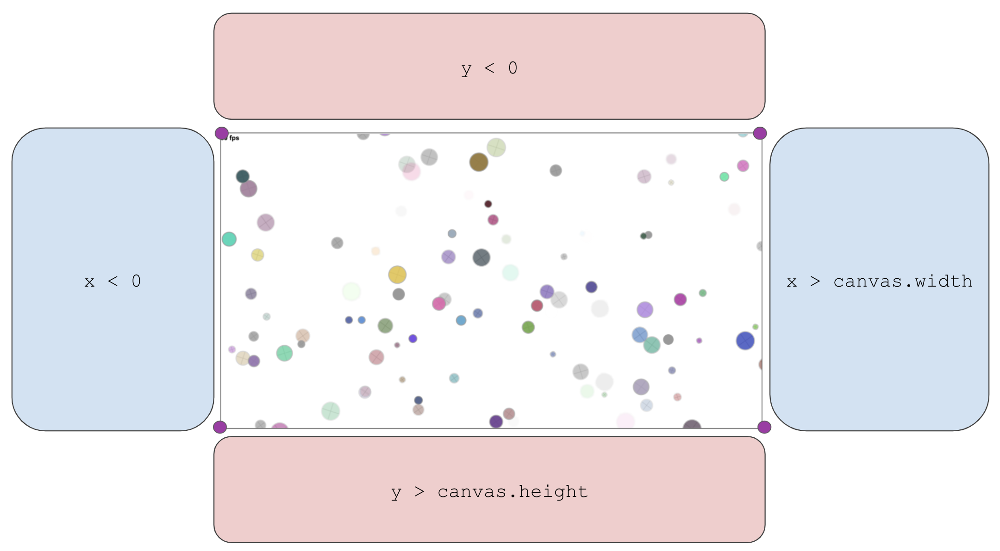

Circularity
===

A motion poem using random number generation and velocity applied to circles...

Also at: http://bit.ly/op-spark-circularity

**Table of Contents**


- [Overview](#overview)
- [Lesson Steps](#lesson-steps)
	- [TODO 1 : Declare Our Variables](#todo-1--declare-our-variables)
	- [TODO 2 : Create a function to draw a circle](#todo-2--create-a-function-to-draw-a-circle)
	- [TODO 3 : Draw 5 circles!](#todo-3--draw-5-circles)
	- [TODO 4 : Move your circles](#todo-4--move-your-circles)
	- [TODO 5 : Keep your circles in the screen](#todo-5--keep-your-circles-in-the-screen)
	- [TODO 6 : Loop from all sides](#todo-6--loop-from-all-sides)
	- [TODO 7 : Draw 100 circles](#todo-7--draw-100-circles)
	- [TODO 8 : Iterate over the array](#todo-8--Iterate-over-the-array)
	- [TODO 9 : Move all our circles and keep them all in bounds](#todo-9--move-all-our-circles-and-keep-them-all-in-bounds)
	- [TODO 10 : Go Live](#todo-10--go-live)


## Overview

The portrait of the programmer as a young artist continues, using random number generation, color, and velocity applied to circles in this little motion poem. Using the draw line API, you'll create a cool randomized piece of art. 

Some concepts you'll practice and learn:
* Drawing with CreateJS and our draw utility.
* Leveraging the power of built-in and 3rd party API (DRY), like Math and opspark-draw.
* Variable declaration and initialization.
* Function invocation and passing arguments to functions.
* Looping.
* Conditional statements - making decisions in code.
* Recognizing code blocks.
* Calculating coordinates in a cartesian system.
* Calculating boundaries.
* Animating.

# Lesson Steps

## **TODO 1 :** *Declare Our Variables*

The goal of this project is to create 100 animated circles. Before we get ahead of ourselves, let's create one circle.

**FIND:** 
* Locate the `js/init.js` file. We will do all our coding in this file. 
* Find the `PROGRAM SETUP` comment within your file. The area where you willl add the code for `TODO 1` will be below.

**CODE:**
* Declare a variable to hold one circle (we will deal with initializing it later),  as well as an empty array to hold our circles (more on that later):

	* Make sure under **TODO 1**,  you declared 2 variables: `circle` and `circles`
	  <details>

	  **<summary>What your code should look like:</summary>**

      ````javascript
	    // TODO 1: Declare our variables //
	    var circle;			// variable to hold a single circle when creating circles / iterating
	    var circles = [];	// variable to store all circles in one Array
	  ````
	</details>

<hr>

## **TODO 2 :** *Create a function to draw a circle*

We will want to draw many circles in this project so putting the code to draw one circle inside a **function** will make the code much more re-usable! We've created a variable for you called `drawCircle` to hold our function. 

**FIND:** 

* Locate the `// TODO: 2` comment within the `PROGRAM SETUP` section of your file.

**CODE:** 

* Declare a Function called `drawCircle`. It should have no Parameters. When called, it should execute the sequence below:

	````javascript
	// Code to draw a circle
	circle = draw.randomCircleInArea(canvas, true, true, '#999', 2);
	physikz.addRandomVelocity(circle, canvas);
	view.addChild(circle);
	circles.push(circle);

	````

	><details> 
	><summary> HINT: to create a function use the following syntax: </summary> 
    >
	>`function nameOfFunction(parameters) { }`
	></details></span>


	><details> 
	>
	>**<summary> What does this code actually do? </summary>**
	>
	>First we call a function from the `draw` library: a collection of functions that allow us to draw various shapes on our `canvas`. This method, `draw.randomCircleInArea` will draw a circle of random size, color, and location within the screen along with a few other settings. Check out the parameters of the function below:
	>
	>    randomCircleInArea(area, randomizeAlpha, addCross, borderColor, borderThickness, randomRadialProps)
	>    
	>We temporarily store the output of the function in `circle`. We then use the `physikz` library, a library of functions that provide motion to canvas drawings, to add a random velocity and direction to our circle.
	>
	>To get the circle to appear on the screen we add the circle as a *child* of `view` (Think of the parent <-> child relationship of HTML elements!).
	>
	>Lastly we save each new circle in an array using the `.push()` method. Doing so keeps >all circles that we make together in one location which will be very useful very soon!

	</details>
<hr>

## **TODO 3 :** *Draw 5 circles!*

**FIND:** 

* Locate the `// TODO: 3 / 7` comment within the `PROGRAM SETUP` section of your file.

	```js
	// TODO 3 / 7 : Call the drawCircle() function 

	/* Your Function Calls HERE */
	```
**CODE:** 

* Call your new `drawCircle` Function 5 times:

	* **HINT:** You can make a **Function Call** using the following syntax:

		```javascript
		nameOfFunction();
		```

**TEST:** 
* Save your code and refresh your game

For now, by copying and pasting these function calls we are violating the **DRY Rule: D**ont **R**epeat **Y**ourself. Keep this in mind as we move on. We'll find a better way to do this later!

<hr>

## **TODO 4 :** *Move your circles*

Awesome, let's do some fun stuff with our circles now.  

**FIND:** 

* Locate the `function update()` declaration where we will write code to animate our circles. 

>💡 **Before you move on, let's reflect.** 
>Remember that the `update()` Function is called 60 times per second (also referred to as 60 ticks/frames per second), and on each new frame we want to move our circles slightly.
>
>The `physikz.updatePosition( circle )` Function, which accepts a circle as an argument, will redraw that circle in a new location!
>
>Since our circles are all stored in the `circles` **Array** we must use **_Bracket Notation_** to pull out each individual circle to be moved. Bracket Notation includes the **Index** of the value that we want to pull out of the Array. The first value in the Array has an index of `0`, the next has an index of `1`, and so on.
>
>```javascript
>myArray[0] //--> returns the first value in myArray
>myArray[1] //--> returns the second value in myArray
>```

**CODE:** 

* Call the `physikz.updatePosition()` function within your update function. 
* Pass in the **first circle** in the `circles` Array as its argument. 
* Do the same with the other 4 circles. 
	<details>
	
	**<summary>Your code should look like this</summary>***

	```javascript
	function update() {
		// TODO 4 : Update the circle's position //

		physikz.updatePosition( /* Your Bracket Notation HERE */ );
		physikz.updatePosition( /* Your Bracket Notation HERE */ );
		physikz.updatePosition( /* Your Bracket Notation HERE */ );
		physikz.updatePosition( /* Your Bracket Notation HERE */ );
		physikz.updatePosition( /* Your Bracket Notation HERE */ );
	}
	```
	</details>


>### *Suggestion*
>
>You can make your circles move more quickly (once they are moving) by changing the `physikz.addRandomVelocity` line to have two extra arguments. This will make testing future steps easier.
>
>Back up in the `drawCircle()` function, try changing that line to be `physikz.addRandomVelocity(circle, canvas, 10, 10);`. If you want the circles to go faster, put bigger numbers. If you want them to go slower, put smaller ones.

<hr>

## **TODO 5 :** *Keep your circles in the screen*

The incomplete Function `game.checkCirclePosition()`, when called, is meant to keep circles that stray off the screen on the screen. 

**FIND:** 

* Locate the `// TODO 5` comment within the `update` Function  

**CODE:** 

* Call the `game.checkCirclePosition()` Function within the update function. 
* Pass in the **first circle** in the `circles` Array as its argument. 
* Do the same with the other 4 circles. 

	<details>

	**<summary>Your code should look like this</summary>**
	Of course, remembering your actual bracket notation will be replacing `/* Your Bracket Notation HERE */`

	```javascript
	// TODO 5 : Call game.checkCirclePosition() on your circles.

	game.checkCirclePosition( /* Your Bracket Notation HERE */ );
	game.checkCirclePosition( /* Your Bracket Notation HERE */ );
	game.checkCirclePosition( /* Your Bracket Notation HERE */ );
	game.checkCirclePosition( /* Your Bracket Notation HERE */ );
	game.checkCirclePosition( /* Your Bracket Notation HERE */ );
	```
	</details>

**TEST:** 	

* Save your code and refresh your program.

	* At this point you'll notice that the circles only come back if they exit through the right side of the screen. In the next part, we'll fix this.

<hr>


## **TODO 6 :** *Loop from all sides*

>### **IMPORTANT - Read about the circle and canvas to figure out this next part**
>
>First, lets talk about **The Circle**.
>>
>> * Each `circle` has 2 properties: `circle.x` and `circle.y`
>>		- `circle.x` is the current position of the circle along the _x-axis_.
>>		- `circle.y` is the current position of the circle along the _y-axis_. 
>>
>Now, about **The Canvas**.
>
>>* The `canvas` represents the blank screen and allows us to add drawings to it. The canvas has 2 very important *properties*:
>>		- `canvas.width` is the _maximum x-coordinate_ on the screen.
>>		- `canvas.height` is the _maximum y-coordinate_ on the screen.
>>
>Now if there are maximum coordinates, there should be minimum coordinates right? You are absolutely correct! 
>>* The _minimum x_ and _y_ coordinates are `0` and `0`. This is called the _origin_, where the x-axis and y-axis intersect at 0. This point is always located in the top left corner of the browser window. 
>>
>
>
>Since `canvas.width` is the **Maximum** x-coordinate on the screen, if `circle.x` is greater than that value, then we know the box has drifted past the right side of the screen.
>
>`circle.x = 0` then re-assigns the x-coordinate of the circle to the position `0`, placing it on the left side - opposite of where the box left the screen!
>

The Function is incomplete however. It only keeps circles that exit the right side on the screen! 

**FIND:** 

* Locate the Function Declaration for `game.checkCirclePosition()`. 

	<details>

	*<summary>It should look like this:</summary>*

	```js
	game.checkCirclePosition = function(circle) {

		// if the circle has gone past the RIGHT side of the screen then place it on the LEFT
		if ( circle.x > canvas.width ) {
			circle.x = 0;
		}
		
		// TODO 7 : YOUR CODE STARTS HERE //////////////////////
		
		/* Your conditional statements HERE */

		// YOUR TODO 7 CODE ENDS HERE //////////////////////////
	}
	```
	</details>


**CODE:** 
* Add additional `if` statements to check the other three sides of the screen. 
	* For each `if` statement, write a comment that explains what the conditional statement checks for 
		* *Ex*: 'What side of the screen is your circle going off?', and what happens when the condition becomes true ('Where do you want to place the circle once it's off the screen?'). 
	* Adding these comments before attempting to build your remaining 3 conditional statements will help make your life a bit easier by outlining which conditions you are building for. Don't be the coder that finds out later you were off track simply by not knowing what condition you were testing for! 
	
* **CHALLENGE:** The circle is centered around its own `x` and `y` position. To find the outer right edge of the circle, we can use the `circle.radius` property like so:

	```javascript
	var rightEdge = circle.x + circle.radius;
	```

	* Use the `circle.radius` property to calculate the four edges of the circle to make the  circle more smoothly exit and enter the screen!


><details> 
>
>**<summary> Debugging your Code (Hints for common issues) </summary>**
>
>### *Issue 1: Circles disappear*
>Possible causes:
> * You didn't handle the cases of all four sides
> * You used `else if` or `else` for some of the conditional statements (all four checks should be independent)
> * One or more of your conditions are incorrect
> * One or more of your assignments are incorrect
>
>### *Issue 2: Circles get stuck*
>This is caused by:
>* If you move the circle to the wrong location. 
>	* Check each assignment in your conditional statements and make sure you are sending your circle to the opposite side of the canvas. 
>
>* If you are not changing the x value for the top and bottom, or the y value for the left and right.
>
>### *Issue 3: Circles teleport without hitting the edge of the screen*
>This means that at least one of your conditions is correct. 
>* Make sure you are using `canvas.width` and `canvas.height`, and that you aren't putting in raw numbers (except for 0 -- that one is okay).
>
></details>
<hr>

## **TODO 7 :** *Draw 100 circles*

A loop should do the job! 

**FIND:** 

* Locate the `// TODO 3 / 7` comment and your repetitive calls to `drawCircle()`.

**CODE:** 

* Replace your repetitive code with a loop (either a `while` or a `for` loop) that will call the `drawCircle()` Function 100 times.

	<details>

	**<summary> HINT: Here is the basic outline of a while loop that runs 10 times...</summary>**

	```javascript
	var loopsCompleted = 0; 
	while (loopsCompleted < 10) {
		// do something
		loopsCompleted++
	}
	```
	...and a for loop that runs 10 times:

	```js
	for (var loopsCompleted = 0; loopsCompleted < 10; loopsCompleted++) {
		// do something
	}
	```
	</details>
	
<hr>

## **TODO 8 :** *Iterate over the array*

Now that we have 100 circles, we need a way to move all 100 circles and keep all 100 circles within the screen without calling on each circle individually. **Iterating** is the way to go!
>
>Iteration is the process of accessing every element in an array and performing some action with that element. 
>
>To help iterate, we want to answer the following questions:
>1. What are you trying to repeat?
>2. What needs to change from loop to loop?
>3. How long will the loop run?
>
>In our case, we want to _access every `circle` from our `circles` array_ and _apply the `physikz.updatePosition(circle)` function on each circle_. The circle is that we call the Function with changes from loop to loop. We will loop until every circle has been called on!
>
>>**To iterate we can follow this pattern**
>>
>>```javascript
>>for (var i = 0; i < myArray.length; i++) {
>>    var eachValue = myArray[i];
>>    
>>    // code to repeat using eachValue
>>}
>>```

How can we apply this pattern to our `circles` array? What code do we want to execute for each value?

**FIND:** 

* Locate the `update` Function. 

**CODE:** 

* Create a loop that will iterate over the `circles` array.
	* Within your loop, create a variable (such as `var eachCircle`) to hold your bracket notation for each circle in the Array. 

<hr>

## **TODO 9 :** *Move all our circles and keep them all in bounds*

Awesome job! Now that we have our loop in place and we are iterating over our `circles` Array, let's use the `circle` that we pull out on each loop to do some cool stuff!

**FIND:** 
* Locate the loop that you created from the previous TODO.

**CODE:** 
* Within the loop's code block, call the `physikz.updatePosition(eachCircle)` function.
* Then, call the `game.checkCirclePosition(eachCircle)` function.
* Now, go back and delete your calls to those functions from **TODO 4** and **TODO 5** with the hardcoded index values
* In place of your deleted function calls, add a comment stating why they were deleted.


Congrats, you've got a fully functional program! Now sit back and relax as you glilde into this last easy step. 

<hr>

## **TODO 10 :** *Go Live*

In your bash terminal, enter the following commands, pressing ENTER after each one:

`git add .`

`git commit -m 'refactor to create 100 circles using loops'`

`git push`

Give it a couple minutes and you should be able to view the additions to your website live on the web at `username.github.io` (Where `username` is your own GitHub username.)

Your Circularity is now safely on GitHub. Congrats!
