# Runtime

Meet Halle, the official Operation Spark robot.

Halle
<br>
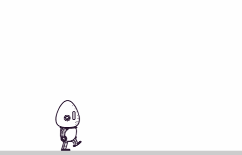

Halle has some cool moves but nobody to play with. Let's build our own game using Halle!

**Table of Contents**

- [Getting Started](#getting-started)
- [Lesson Steps](#lesson-steps)
  - [TODO 0 : Brainstorming](#todo-0--brainstorming)
  - [TODO 1 : Adding A Background](#todo-1--adding-a-background)
  - [Reading Time: Drawing With Create.js](#reading-time-drawing-with-createjs)
  - [TODO 2 : Create Your Own Background](#todo-2--create-your-own-background)
  - [TODO 3 : Animate the Background](#todo-3--animate-the-background)
  - [TODO 4 : Creating a Parallax Effect](#todo-4--creating-a-parallax-effect)
  - [TODO 5 : Create Your First Obstacle](#todo-5--create-your-first-obstacle)
  - [TODO 6 : Make Many Obstacles](#todo-6--make-many-obstacles)
  - [TODO 7 : Enemies!](#todo-7--enemies)
  - [TODO 8 : Enemy Properties](#todo-8--enemy-properties)
  - [TODO 9 : Enemy Function](#todo-9--enemy-function)
  - [TODO 10 : Design A Reward](#todo-10--design-a-reward)
  - [TODO 11 : Add an End-Of-Level Marker](#todo-11--add-an-end-of-level-marker)
  - [TODO 12 : Use Level Data to Create Obstacles](#todo-12--use-level-data-to-create-obstacles)
  - [TODO 13 : Loop Over Data](#todo-13--loop-over-data)
  - [TODO 14 : Go Live](#todo-14--go-live)

# Getting Started

## Installation (IMPORTANT)

### Copy and paste the following commands into the bash terminal, then hit ENTER

If Runtime is not already installed, then you can install it manually. To do so, open a new bash terminal. Then in the terminal, enter the following commands in order (one at a time):

- `cd projects`
- `git clone https://github.com/operationspark/runtime`
- `cd runtime`
- `rm -rf .git*`
- `npm install -g opspark`
- `bower install`
- `cd ../..`
- `git add -A`
- `git commit -m "added runtime"`
- `git push`

> **WARNING:** the `npm install -g opspark` command may take a while to complete

## Run the program

Preview the `index.html` file.

You should see Halle running on a blank background and you should be able to press the appropriate keys to make her jump and shoot.

## Important if you plan on making your own web pages one day

Go back and look at the `index.html` file. `index.html` is an example of the kind of index file you might see in a real-world project. The majority of the code is not in `index.html` itself but is loaded as external scripts.

```html
<script src="js/util/load.js"></script>
<script src="js/util/spin.min.js"></script>
<script src="js/util/point.js"></script>
<script src="js/spritesheet.js"></script>
...
<script src="js/view/ground.js"></script>
<script src="js/player/halle.js"></script>
<script src="js/player/playerManager.js"></script>
<script src="js/opspark.js"></script>
```

The scripts are organized so that each script handles one aspect of the game, with each name describing what they do. Professional developers break code into scripts or modules so that the code is easier to understand and so that many people can work on the code at the same time.

Some of the scripts are _library_ or _third-party_ code. This is code that other people wrote that we can use to do cool stuff.

```html
<script src="bower_components/easeljs/lib/easeljs-0.8.1.min.js"></script>
<script src="bower_components/PreloadJS/lib/preloadjs-0.6.1.min.js"></script>
<script src="bower_components/TweenJS/lib/tweenjs-0.6.1.min.js"></script>
<script src="bower_components/SoundJS/lib/soundjs-0.6.1.min.js"></script>
<script src="bower_components/opspark-draw/draw.js"></script>
```

For this project, we will be using the [create.js](http://createjs.com/) library to draw and animate our game.

# Lesson Steps

## TODO 0 : Brainstorming

Before we start coding, we have to decide what kind of game we want to build with Halle. Look at the kind of moves that Halle can make and imagine how they would fit into **your** game.

Start by creating a shared document on Google Drive. Write down notes for your ideas. Below is everything that you need to decide.

1. You will need to decide on a general _theme_ for the game. What kind of world is Halle in? Is she in space, in a factory, on the streets of New Orleans?

2. Find images online that fit your theme. Definitely copy them into your `img` folder, and optionally into your Google doc as well. You can do so by first downloading the images, and subsequently uploading them into Gitpod.

3. What are the _game mechanics_? What are the goals and what are the challenges? What might Halle encounter as the game progresses? Are there points or a score? How does the game end?

4. Finally, come up with good _names_ for your game levels and obstacles. You will be naming everything, but if you later change your mind, don't worry. You can always change it later in your code.

## TODO 1 : Adding A Background

- **1a)** Choose your own background color!

  **FIND:** The file `js/view/background.js`, where the variable `backgroundFill` is defined (around line 36).

  `backgroundFill` holds the rectangle object returned by the `draw.rect()` function (see Drawing With Create.js below). The `draw.rect()` function takes the following arguments:

  ```js
  draw.rect(width, height, fillColor);
  ```

  **CODE:** This is more tweaking than coding, but you should do the following nonetheless.

  In the `draw.rect()` function call that creates the yellow background:

  - Choose a color that you want for your background and adjust the `fillColor` argument .
  - Change the height of the background. Try out the following values and **choose which one you like best**. Try `canvasHeight`, `100`, and `groundY`, or other values if you don't like any of those.

  As a last step, depending on the background you've built, your heads-up-display may be hard to see or just plain ugly. Modify the colors used by `js/view/hud.js` to match your background.

# Reading Time: Drawing With Create.js

# (Read if you want to customize graphics, which you should definitely do)

> <details> <summary> Click the arrow to read about adding graphics! </summary>
>
> ## NOTE: Do not copy any code in this section. Just read this section. It will help you understand how to customize your background in TODO 3
>
> Create.js is a **library** of functions stored in the `draw` Object that let you add drawings to your program. Each function returns a new Object with properties that define the object's appearance, location on the screen, and much more.
>
> So, in order to draw something you will create a _shape variable_ that will hold that object:
>
> | Image                             | Code                                                                       |
> | --------------------------------- | -------------------------------------------------------------------------- |
> | 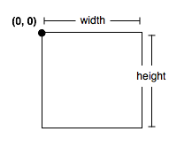   | `var shape = draw.rect(width, height, color, strokeColor, strokeWidth);`   |
> | 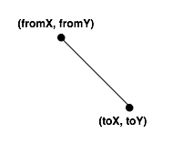   | `var shape = draw.line(fromX, fromY, toX, toY, strokeColor, strokeWidth);` |
> | 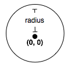 | `var shape = draw.circle(radius, color, strokeColor, strokeWidth);`        |
> | 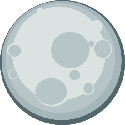   | `var shape = draw.bitmap('img/moon.png');`                                 |
>
> In order to make your shape show on sreen you will need to add it to the `background` by calling
>
> ```js
> background.addChild(shape);
> ```
>
> Your shape will be created so that it appears at the upper-left hand corner of the screen, at `(0,0)` in your game's coordinate system, but you can place a shape anywhere on the screen by setting its `x` and `y` properties.
>
> ```js
> shape.x = 100;
> shape.y = 45;
> ```
>
> Remember that `x` and `y` refer to a coordinate system which has an origin (0,0) in the upper-left hand corner. `x` becomes larger as you move to the right. `y` becomes larger as you move downward.
>
> 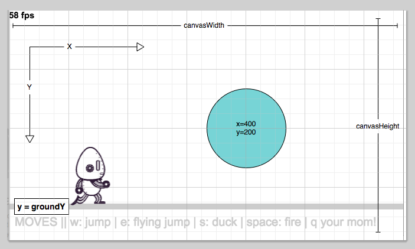
>
> ## Helpful Variables
>
> We've defined a couple of variables that should help you draw shapes in the right place.
>
> `canvasWidth` is the total width of the game screen  
> `canvasHeight` is the total height of the game screen  
> `groundY` is the y coordinate of the ground line
>
> See the [opspark-draw documentation](https://libraries.io/bower/opspark-draw) for more details on drawing functions you can use or look at the source directly in your project at `bower_components/opspark-draw/draw.js`. You can also use anything in the [create.js API](http://www.createjs.com/docs/easeljs/modules/EaselJS.html).
>
> ## Adding your own Images for a bitmap object
>
> The moon.png image is stored in the img folder. You can add your own custom images too! Once you have downloaded the image you would like to add (you can easily find png pictures by adding .png to your google image search) you can upload that file to your workspace.
>
> - Select the img folder
> - Right click on the img folder -> Upload -> Select / Drag & Drop downloaded image.
> - Move that image into the img folder
> - call `draw.bitmap()` using 'img/<name of your picture.png>' for the argument
>
> </details>


## TODO 2 : Create Your Own Background

You are free to customize the background however you wish, but you should at least make one prominent feature and one many-component feature (see the stars below). If you don't want to customize the background, then you can simply add a moon and stars as described below.

**NOTE:** The order that you add shapes to your background matters so be sure to add any additional shapes _below_ where you add backgroundFill to the background.\*\*

- **2a)** **FIND:** `TODO: 2` in `js/view/background.js` within the `render()` function. Both the moon and star field will be created there. If you make a custom background, it should also go there.

### Moon

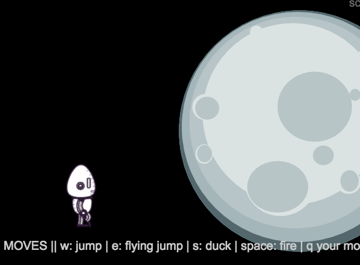

**REMINDER:** You can add images to your background using `draw.bitmap()`

**CODE:** Add the following code into the render function. You should tweak the variable values to move the moon to a good location (the `x` and `y` properties) and give it the proper size (the `scaleX` and `scaleY` properties).

```js
var moon = draw.bitmap("img/moon.png");
moon.x = 300;
moon.y = 200;
moon.scaleX = 10.0;
moon.scaleY = 10.0;
background.addChild(moon);
```

### Star Field

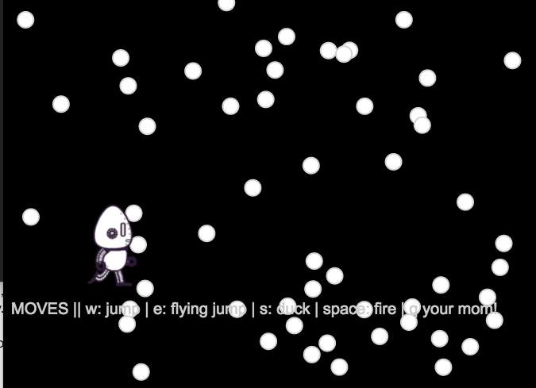

- **2b)** **CODE:** Use a `for` loop to draw a bunch of objects to the screen. Make at least 100 and at most 1000. The code that should go inside of your for loop is as follows:

```js
var circle = draw.circle(10, "white", "LightGray", 2);
circle.x = canvasWidth * Math.random();
circle.y = groundY * Math.random();
background.addChild(circle);
```

- **2c)** **CODE:** Try changing the above code to make the result look more like actual stars. You'll want to draw something other than circles to do that, so check the **Drawing With Create.js** section above if you haven't already.


## TODO 3 : Animate the Background

><details> <summary> Click to see important animation information </summary>
>
>If you look in the upper left-hand corner of the game, you will see something like "57 fps". That means the game is running at 57 frames-per-second. Each "frame" is one drawing of our game and so we are redrawing the game 57 times every second. By making slight changes to what we draw over time we can give the illusion of motion.
>
>In `background.js`, the `render()` function sets up our scene and the `update()` function is called once per frame. Whatever changes we make to the scene are drawn on the next frame.
>
></details>

<hr>

- **3a)** Draw a tree

  Let's draw a tree on the screen. We will call it `tree`.

  **FIND:** In `background.js`, above the beginning of the `render` function, there is a comment ` ANIMATION VARIABLES HERE`

  **CODE:** Declare a variable `tree` _outside_ the `render` function and directly below that comment.

  > **IMPORTANT:** You must make the `tree` variable exactly where specified because of something known as "scope". Essentially, by making the `tree` variable outside of the `render` function, it can be used both in the `render` and the `update` functions.

  **FIND:** `TODO 3: part 1` inside of the `render` function

  **CODE:** store a bitmap in `tree` variable and add it to the background. The below code shows you not only how to do this, but how to set default `x` and `y` values for the bitmap as well.

  ```js
  tree = draw.bitmap("img/tree.png");
  tree.x = 0;
  tree.y = 0;
  background.addChild(tree);
  ```

  > **TESTING:**
  > You should now see a tree in your background! Change the values of `tree.x` and `tree.y` so that the tree appears on the ground in front of Halle.

  > **IMPORTANT:** When setting the `tree.y` value, you should use `groundY` as a reference, so you should have something like `tree.y = groundY + 20;` or `tree.y = groundY - 30;` when setting the `y` value. This will be true for all objects from this point on.

<hr>

- **3b)** Move The Tree

  We can perform animation by making changes to our scene in the `update()` function. Remember that it is called once for each frame of the game.

  **FIND:** `TODO 3: part 2` in the `update` function

  The goal is to make the tree move to the left and wrap around the screen if it goes offscreen to the left.

  **CODE:** Add the following code:

  ```js
  tree.x = tree.x + 1;

  if (tree.x < -200) {
    tree.x = canvasWidth;
  }
  ```

  > **TESTING:**
  > You should now see the tree moving to the right.

<hr>

- **3c)** Make the tree move to the left. It is up to you to figure out why it is moving to the right, and then fix that issue so that it moves left instead.

  > **TESTING:**
  > The tree should now be moving to the left


## TODO 4 : Creating a Parallax Effect

### Parallax

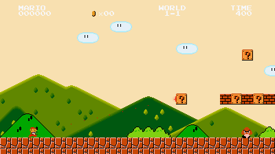

Parallax is a technique in animation for giving the illusion of depth. When you are moving, things that are close to you move quickly whereas things that are very far away may move slowly or not appear to move at all. You will want to do that by adding in more background pieces.

<hr>

- **4a)** Add buildings to the background

  **FIND:** where the `tree` variable was declared (_NOT_ where it was defined in the `render` function)

  **CODE:** After the declaration of `tree` declare a variable `buildings` and assign it an empty array. We will use this array to collect some drawings.

  > **HINT:** an empty array is simply `[]`

  **FIND:** `TODO 4: part 1` inside of the `render` function

  **CODE:** create several rectangles using a `for` loop and add them to `buildings` array. You can use the following code, but make sure you understand what each line of it does.

  ```js
  for (var i = 0; i < 5; ++i) {
    var buildingHeight = 300;
    var building = draw.rect(75, buildingHeight, "LightGray", "Black", 1);
    building.x = 200 * i;
    building.y = groundY - buildingHeight;
    background.addChild(building);
    buildings.push(building);
  }
  ```

  > **TESTING:**
  > You should see this:
  > 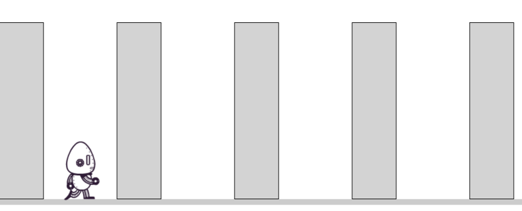

<hr>

- **4b)** Change how the buildings appear

  **CODE:** Edit the copied code to give the buildings different heights and colors than the default.

  > **CHALLENGE:** Give the buildings random heights.
  >
  > **HINT:** Math.random() is your friend for making random heights.

  

<hr>

- **4c)** Make the buildings move

  **FIND:** `TODO 4: part 2` in the `update` function

  **CODE:** Now, write code in `update` that animates the buildings so that they move towards Halle. We already know how to move the `tree`, so moving the buildings won't be too hard!

  However, our `buildings` Array contains the building objects that we want to move. This means that **Iteration** is required!

  > **HINT:** Remember, to iterate, we can create a `for` loop that looks like this:
  >
  > ```js
  > for (var i = 0; i < myArray.length; i++) {
  >   var eachElement = myArray[i];
  >
  >   // code to do something with each element
  > }
  > ```
  >
  > Recall what your array name is before making the loop. If you use generic names like `myArray`, your code will not work (because you never made variables with that name)!

<hr>

- **4d)** Implement Parallax

  **CODE:** Now make the buildings and tree move at different speeds. Recall what determined the tree's direction, because that's the same thing that determines speed!

  > **CHALLENGE:** Change your building / box drawings to something unique!

  > **TESTING:**
  > At this point, the buildings should be moving to the left, and they should be going at a different speed than the tree.


## TODO 5 : Create Your First Obstacle

You've created a rad background and are now ready to move on to gameplay. You'll be coding up and designing some game elements which Halle can interact with. The game manager provides an API for creating objects which move around the screen and can be run into, jumped over, or shot with Halle's gun.

An obstacle is the simplest element in our game. It moves at a fixed speed toward Halle as the game progresses. The obstacle must be avoided by either jumping or ducking and cannot be destroyed by being shot with Halle's gun. If the obstacle collides with Halle, Halle takes damage. If Halle takes enough damage, she dies and the game is over.

<hr>

- **5a)** Create the hitzone

  **FIND:** in `js/runLevels.js` inside of the `runLevelInGame` function, look for the comment `// BEGIN EDITING YOUR CODE HERE`

  **CODE:** Add in the following lines of code. The first two lines define the size of the hitbox (an invisible region that determines if Hallebot actually touches the obstacle) and how much damage the obstacle causes on impact. The last line creates the obstacle.

  ```js
  var hitZoneSize = 25;
  var damageFromObstacle = 10;
  var sawBladeHitZone = game.createObstacle(hitZoneSize, damageFromObstacle);
  ```

  > **NOTE:** This obstacle has no image or position yet, and has in fact not even been added to the game. As such, you won't see anything new if you preview your game at this point.

<hr>

- **5b)** Position the hitzone

  **CODE:** Position that obstacle hitzone somewhere on screen by modifying the `x` and `y` properties of `sawBladeHitZone`, then add the obstacle to the game. Add this code to the code you just wrote:

  ```js
  sawBladeHitZone.x = 400;
  sawBladeHitZone.y = 100;
  game.addGameItem(sawBladeHitZone);
  ```

  Once this is done correctly, you should see a gray circle on the screen which moves towards Halle.

  

  > **NOTE:** The circle you see on the screen is the "hitzone" for the obstacle. Once that hitzone collides with Halle, you should see Halle's health indicator decrease by the amount you specified in `damageFromObstacle`.

  **CODE:** Change the `y` property of `sawBladeHitZone` so that it eventually collides with Halle

  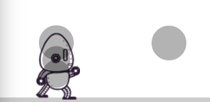

  > **OPTIONAL:** Halle has hitzones too. Open up `init.js` and find the `debugHalleHitZones`(line 27) variable and change it to `true` You should now see the circles that make up Halle's hitzone.

<hr>

- **5c)** Add an image to your hitzone

  The hitzones in our game are used for collision detection and always present, but when we are playing our game we don't actually show them. Instead of circles, we draw something that represents our obstacle. Let's make our first obstacle be a saw blade.

  **FIND:** `runLevels.js`, right after the last code you wrote.

  **CODE:** Add the following code:

  ```js
  var obstacleImage = draw.bitmap("img/sawblade.png");
  sawBladeHitZone.addChild(obstacleImage);
  ```

  This loads up an image and adds it to our obstacle. You should now see a saw blade on the screen.

  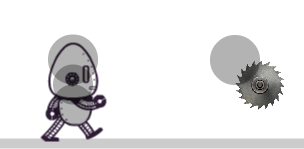

  > **IMPORTANT:** You should also notice that saw blade doesn't fit within the hitzone. This is because the top left corner of the box that surrounds the sawblade image is placed at the center of `sawBladeHitZone` hitzone. You must alter the `x` and `y` properties of the _image_ to make it line up with the hitzone.

  **CODE:** Adjust the `x` and `y` property of `obstacleImage` so that it fits perfectly within the hit zone of `sawBladeHitZone`. Change their values to be exactly the negative of the hitbox size. For example, if the size is 10 (it's not), then you would set both `obstacleImage.x` and `obstacleImage.y` to be `-10`.

  > **TESTING:**
  > When you are done you should see:
  >
  > 

  > **NOTE:** if you want to hide your hitzones, you can do so by
  >
  > 1. In `init.js`, change the `debugHalleHitZones` variable to false.
  > 2. In `js/runLevels.js` pass `false` to the method `game.setDebugMode()`


## TODO 6 : Make Many Obstacles

Now that we know the sequence to make a single sawblade, let's make more!

Rather than copy-pasting the 10 lines of code each time we want another sawblade, let's instead turn those 10 lines into a **Function**!

- **6a)** Take the 10 lines of code you just wrote for creating a single sawblade and turn them into a Function that can be reused.

  **CODE:** Create the following function:

  - **Name:** `createSawBlade`
  - **Parameters:**
    1. `x`: the `x` position of the new saw blade's hitzone
    2. `y`: the `y` position of the new saw blade's hitzone
  - **Returns:** Nothing
  - **Description:**
    1. This function should contain the 10 lines of code from TODO 6 that are used to create a new saw blade.
    2. `sawBladeHitZone.x` and `sawBladeHitZone.y` should be assigned the values of the parameters instead of being hard coded.

  **CODE:** Once you have created your Function, call it 3 times with different arguments for `x` and `y`. You should place the saw blades so Halle can jump over some and duck others. **Don't spend too much time on positioning, as you will be changing this part later.**

  > **TESTING:**
  > Your game should look something like this, except the saw blades might be in different locations.

  > 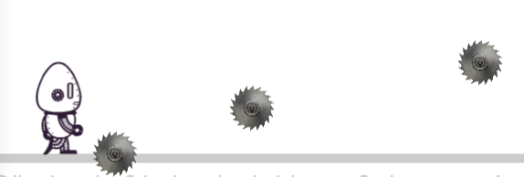

> **HINTS:** <details> <summary> Click the arrow if you want hints! </summary>
> To declare a Function, we can write:
>
> ```js
> function myFunctionName(parameter1Name, parameter2Name) {
>   // your code to be reused goes here
> }
> ```
>
> When turning a sequence of code into a Function that uses Parameters, identify the data values in that sequence that depend on user-input and replace those with Parameters.
>
> For example, consider this sequence that calculates an average of two numbers and then prints it to the console:
>
> ```js
> var average1 = (20 + 40) / 2;
> console.log("the average of " + 20 + " and " + 40 + " is " + average1); //==> The average of 20 and 40 is 30
>
> var average2 = (5 + 10) / 2;
> console.log("the average of " + 5 + " and " + 10 + " is " + average2); //==> The average of 5 and 10 is 7.5
> ```
>
> If you wanted to make this sequence into a Function, we might write:
>
> ```js
> function average(x, y) {
>   var average = (x + y) / 2;
>   console.log("the average of " + x + " and " + y + " is " + average);
> }
> ```
>
> Notice that the hard-coded numbers to be averaged have been replaced by the parameters `x` and `y` each time they are used.
>
> And then we could call the Function, passing in values that will be held by `x` and `y` and then used by the Function:
>
> ```js
> average(20, 40); //==> The average of 20 and 40 is 30
> average(5, 10); //==> The average of 5 and 10 is 7.5
> ```
>
> </details>

- **6b)** Make sure that at this point you have all of your sawBlade code confined to your `createSawBlade` function. If you copy-pasted the code into the function, please delete the original code at this point.


## TODO 7 : Enemies!

Obstacles are only one kind of thing you might find in a game. In most games, you have enemies you have to avoid or shoot as well as different items which you can collect to increase your score or give you powers. These are slightly more complex than obstacles, but you're ready to do them now.

- **7a)** We are going to create a new game item similar to how we created our other obstacles. Add the following code:

  ```js
  var enemy = game.createGameItem("enemy", 25);
  var redSquare = draw.rect(50, 50, "red");
  redSquare.x = -25;
  redSquare.y = -25;
  enemy.addChild(redSquare);
  ```

  > **READ:** Notice that here we use `game.createGameItem` instead of `game.createObstacle`. These two functions are similar, but `game.createGameItem` gives us more control over how the new object will behave in the game.

- **7b)** Now that you have code to create the enemy, you need to position the `enemy` on screen:

  ```js
  enemy.x = 400;
  enemy.y = groundY - 50;
  ```

- **7c)** Finally you must call `addGameItem()` in order to show the enemy on screen.

  ```js
  game.addGameItem(enemy);
  ```

  > **TESTING:**
  > When that is done correctly you should see a red square on the screen. It will not be moving (yet).
  >
  > 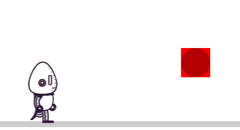

> **CHALLENGE:** Customize how your enemy looks. Try making it bigger or drawing some other shapes.


## TODO 8 : Enemy Properties

The variable `enemy` is an object created by `createGameItem()` which has a number of properties you can set in order to customize how the item behaves in the game. In this step, we are going to play around with those properties.

- **8a)** `velocityX`, `velocityY`, and `rotationalVelocity`

  **READ:** The above properties affect the movement of game items. For example, if you wrote `enemy.velocityX = 1;`, then the enemy would move to the right at a rate of 1 pixel per frame.

  **CODE:** Assign values to `enemy.velocityX` and `enemy.rotationalVelocity` to make the enemy move and spin. Both properties should be given numbers as values. Optionally, you may also set the enemy's `velocityY` property to a value, though this isn't recommended.

- **8b)** `onPlayerCollision`

  **READ:** The `onPlayerCollision` property holds a different kind of value. Instead of a number or a string, its value is a function. This function is called whenever that game item collides with Halle. You may have noticed that our enemy currently passes through Halle without any kind of effect. That is because when the game item is first created, the function in the `onPlayerCollision` property does nothing.

  **CODE:** Make it so that the `onPlayerCollision` function does something. First, write an empty function and assign it to the `onPlayerCollision` property.

  ```js
  enemy.onPlayerCollision = function () {};
  ```

  Next, add the line `game.changeIntegrity(-10)` into the function body. This will cause Halle to lose health when she collides with an enemy. Putting a positive number would increase her health. Give a number that you think is appropriate for this collision, then test your game. If you want to do more than simply change health, feel free to do so.

- **8c)** `onProjectileCollision`

  The `onProjectileCollision` property works much like `onPlayerCollision`, but instead the function is called whenever Halle successfully shoots the game item.

  **CODE:** Create a new empty function and assign it to `enemy.onProjectileCollision`. Then, add the following lines of code to the function body.

  ```js
  game.increaseScore(100);
  enemy.fadeOut();
  ```

  The above code will increase your score by 100 and also make the enemy vanish when it is shot. Set the score to whatever value you think is best, and optionally change `fadeout` to one of the following:

  - `shrink()` will cause the item to decrease in size out of existence
  - `flyTo(x,y)` will cause the item to quickly move to a place on screen defined by `x` and `y`


## TODO 9 : Enemy Function

**CODE:** You now should know enough to make your own enemy. To get started, take all of the code you wrote in TODOs 7 & 8 and move it into a new function called `createEnemy`

```js
function createEnemy() {
  // all code from TODO 11 and 12
}
```

Introduce two parameters `x` and `y` into your function

```js
function createEnemy(x, y) {
  // all code from TODO 11 and 12
}
```

Then use `x` and `y` in your function body to place the enemy in a location given by those parameters.

You can now call the `createEnemy()` function multiple times to make several enemies.

```js
createEnemy(400, groundY - 10);
createEnemy(800, groundY - 100);
createEnemy(1200, groundY - 50);
```

Once you have completed this step, you will have working enemies for your game.


## TODO 10 : Design A Reward

Now that we have Obstacles and Enemies, we need a reward for HalleBot to get!

**CODE:** Make a function `createReward` that will create a reward (a gameItem) with a few special properties:

- When HalleBot collides with it, it should disappear, and either the score should be increased, or Hallebot's health should go up
- It should disappear when shot

Please note that the `createReward` function will be more like the `createEnemy` function than either of your "createObstacle" functions.


## TODO 11 : Add an End-Of-Level Marker

Now it's time to add one last object to the game. This is the end-of-level marker. There should only be one per level, and it should be at the end of each level.

**CODE:** Make a function `createMarker` that will create an end-of-level marker with the following properties.

- When HalleBot collides with it or shoots it, then the level should transition to the next level. To do so, you need to call the `startLevel()` function in both the `onProjectileCollision` and `onPlayerCollision` function methods.

Please make sure that the marker cannot be missed by HalleBot. You will also want to make sure that if you shoot it, there is nothing else on the screen at the time, as moving on to the next level does NOT remove existing objects from the current level.


## TODO 12 : Use Level Data to Create Obstacles

In a professional game, there are two important parts to creating levels:

- game designers build/design a game by determining what components of a game should exist and where, and they store this information as data
- the programmers write the code for a game engine which uses this data to build the game world

This data, as well as all of the artwork, defines the entire world of the game. Separating the game code from the data allows you to easily modify the behavior and gameplay of the game without actually modifying the code.

For runtime, this data is stored in the `levelData` variable in `js/levelData.js`.

**FIND:** the `levelData` variable near the top of `js/levelData.js`. It should look like this:

```js
var levelData = [
  {
    name: "Robot Romp",
    number: 1,
    speed: -3,
    gameItems: [
      { type: "sawblade", x: 400, y: groundY },
      { type: "sawblade", x: 600, y: groundY },
      { type: "sawblade", x: 900, y: groundY },
    ],
  },
  {
    name: "Robot Rampage",
    number: 2,
    speed: -3,
    gameItems: [
      { type: "sawblade", x: 400, y: groundY },
      { type: "sawblade", x: 600, y: groundY },
      { type: "sawblade", x: 900, y: groundY },
    ],
  },
];
```

> **IMPORTANT:** Notice what is going on here. `levelData` is an array of objects. Inside each object, there is a property `gameItems` whose value is an **Array** of more **Objects**. In `levelData[0].gameItems` for instance, you should see three Objects, each with a `.type`, `.x`, and `.y` property.

<hr>

- **12a)** Add more gameItems to the `gameItems` arrays.

  **CODE:** Add in _at least_ one of each of the other types of objects you can create. So, you should have at least three saws, at least one enemy, at least one reward, and an end-of-level marker in both the level 1 and level 2 data.

  For instance, to add in a reward, you could put:

  ```js
  { "type": "reward", "x": 2000, "y": groundY - 60},
  ```

  The value of the `"type"` property (e.g. "sawblade", "reward") can be whatever you want. Just make sure you keep track of which is which!

- **12b)** Add more levels to the game!

  **CODE:** You can add more levels to the game as well. Notice how each level is an object in the `levelData` array. So, you can make another object (or copy/paste an existing one) at the end of the array to make more levels! **You must make at least 1 more level**, but you can make more if you want as well.


## TODO 13 : Loop Over Data

Now that you have a lot of level data, you need to make your program actually use that data to build the levels.

> **REMINDER: `levelData` is an array of objects, and each object stores (among other things) another array of objects.** So, for example, if you wanted to get an object representing the second game item in memory, you could write `var secondObject = levelData[0].gameItems[1];`, and if you wanted to get the `type` property from that object, you could then say `var secondType = secondObject.type;`. Note how **accessing values in the data requires a combination of dot notation and bracket notation**.

<hr>

- **13a)** Select the current level's object

  **READ:** `levelData` is an array of objects, and there is a variable called `currentLevel` that keeps track of which level you are currently on.

  **CODE:**  Create a new variable called `level`. Then, store the corresponding level object inside of that variable. You can do this using the `levelData` array, bracket notation, and `currentLevel` as the index for the bracket notation.

- **13b)** Get the array from the `level` object.

  **CODE:** Create a new variable called `levelObjects`. Then, store the `gameItems` property from your `level` object into `levelObjects`.

- **13c)** Loop over the `levelObjects` array.

  **CODE:** Your task is to use a `for` loop and iterate through the `levelObjects` array. During each loop, call the `createSawblade()`, `createEnemy()`, `createReward()`, and `createMarker()` functions using each object's `.x` and `.y` properties as arguments.

  To decide on which function to call, you will need to use each Object's `.type` value (for instance, `"sawblade"`) in a **series of conditional statements**.

> **HINTS:** <details> <summary> Open to see hints </summary>
>
> **Objects** and **Arrays** are called _collections_ because they are used to collect many pieces of data. They are also considered complex because they can hold any data type, including other arrays or objects.
>
> > **DATA ACCESS:**
> > To access an element of an array you can use _Bracket Notation_ like so: `array[index]`.
> >
> > To access a property value in an Object you can use _Dot Notation_ like so `object.propertyName`.
> >
> > For nested collections, use one after the other. For example, to access the first object in the array `gameObjects` we would write:
> >
> > ```js
> > var firstGameItemObject = gameObjects[0];
> > ```
> >
> > Then, to access the `.x` and `.y` properties of that Object we could write:
> >
> > ```js
> > var firstX = firstGameItemObject.x;
> > var firstY = firstGameItemObject.y;
> > ```
> >
> > To access the `.type` property of the object, you could write:
> >
> > ```js
> > var firstType = firstGameItemObject.type;
> > ```
>
> > **CHECKING THE OBJECT TYPE:**
> > Once you have an object type, you can then use a conditional to check if the type is (for example) `"sawblade"`. If it is, you could create a sawblade using this data:
> >
> > ```js
> > createSawBlade(firstX, firstY);
> > ```
> >
> > You, of course, have more than one type to check for, so you will need to expand your code accordingly.
>
> > **ITERATING:**
> > To run this code with each value in the `gameObjects` Array, we can iterate. Remember, to iterate, we can create a `for` loop that looks like this:
> >
> > ```js
> > for (var i = 0; i < myArray.length; i++) {
> >   var eachElement = myArray[i];
> >
> >   // code to do something with each element
> > }
> > ```
>
> > **REMINDER:** All of the above code is to give you _examples_ of how your code should look. Simply copy-pasting what is above will not give you working code. You are _not_ trying to get just the first object from the array, and you do not have an array called `myArray`, among other issues.
> >
> > It is up to you to figure out how to adapt the code provided to work for your program. What do you have to work with, and what do you need to do with it? If you can answer these questions, then you can complete **13c**!
>
> </details>

<hr>

- **13d)** Cleanup

  Now that your loop handles iteration over `levelData.gameItems` and also calling your object creation functions, you don't need the other function calls in your code.

  **CODE:** Remove all function calls (except the ones in your for loop) to `createSawblade`, `createReward`, etc.


## TODO 14 : Go Live

Enter the following commands, pressing ENTER after each one:

```bash
git add .
git commit -m 'add runtime project'
git push
```

Give it a couple minutes and you should be able to view the additions to your website live on the web at `username.github.io` (Where `username` is your own GitHub username.)

# Congratulations

You've written your first game! Give yourself a chance to play with what you created. Think about how you could make it better and what you would like to see in the game. Then, try changing the code to make it happen.

Any of the code in your game can be modified. Look around in the source code and try to understand it. You can read the documentation for [easel.js](http://www.createjs.com/docs/easeljs/modules/EaselJS.html) to draw more interesting shapes or [tween.js](http://www.createjs.com/tweenjs) to make interesting animations.

Good luck!
